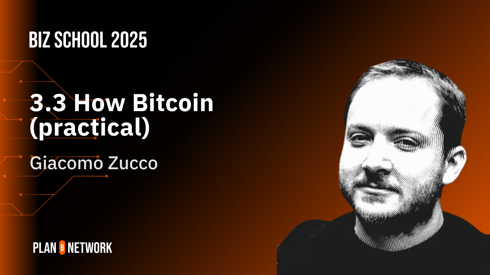

# Bitcoin Business Program

The Plan ₿ Biz School 2025 is an educational program dedicated to students and entrepreneurs who wish to find a non-technical job in a Bitcoin company. The curriculum covers Bitcoin fundamentals, practical applications, and insights from industry experts.

Starting in May, it is designed for students of all levels, who can access lectures either online or in person. After two rounds of selection, the top performers will be selected to attend a Summer School week in Lugano.
+++

# SCHOOL INTRODUCTION

<partId>5acc2f64-781b-4aa7-866f-81415aa0094f</partId>

## SCHOOL INTRODUCTION

<chapterId>768e5a56-2369-4745-b6fd-1c7ec1934a67</chapterId>

<releasePlace>Taipei, Taiwan</releasePlace>
<isOnline>true</isOnline>
<isInPerson>true</isInPerson>
<isGdprCompliance>true</isGdprCompliance>
<startDate>2025-05-02 09:30:00</startDate>
<endDate>2025-05-02 12:30:00</endDate>
<timeZone>Asia/Taipei</timeZone>
<availableSeats>200</availableSeats>
<liveLanguage>English</liveLanguage>
<addressLine1> NTUT, Section 3, Zhongxiao E Rd, Taipei</addressLine1>

#### Welcome to the Plan ₿ Biz School 2025!

We are thrilled to have you join us on this exciting 3-month program!

Over the coming weeks, the course chapters will be updated with all the relevant information about the curricular and guest lectures’ dates and locations. In the meantime, we recommend you to join our exclusive [Telegram Group](https://t.me/+UFoIT5yNePQzYWZk).

In the meantime, feel free to explore our extensive library of over 20 open-source online courses available here on the platform.

If you are new to Bitcoin, we particularly recommend taking "The Bitcoin Journey" online course, that will give you the necessary basic knowledge about Bitcoin.

https://planb.network/courses/2b7dc507-81e3-4b70-88e6-41ed44239966

# WHY BITCOIN?

<partId>3270002a-ed8e-4411-b24b-12596f1b8853</partId>

## Why Bitcoin

<chapterId>a81e8bb0-a137-48cc-9c7f-9bc1534e60c7</chapterId>

<releasePlace>Lugano, Switzerland</releasePlace>
<isOnline>true</isOnline>
<isInPerson>true</isInPerson>
<isGdprCompliance>true</isGdprCompliance>
<startDate>2025-05-05 08:00:00</startDate>
<endDate>2025-05-05 11:00:00</endDate>
<timeZone>Europe/Rome</timeZone>
<availableSeats>15</availableSeats>
<liveLanguage>English</liveLanguage>
<addressLine1>Expo Room, POW Space, Via Giuseppe Motta 7,6900 Lugano</addressLine1>

# HOW BITCOIN?

<partId>6cfc7896-ce51-4296-bcaa-b38a36dff5f9</partId>

## How Bitcoin (theory)

<chapterId>06a6c6f5-ba98-4507-bec3-88ebe1be6805</chapterId>

<releasePlace>Viareggio, Italy</releasePlace>
<isOnline>true</isOnline>
<isInPerson>true</isInPerson>
<isGdprCompliance>true</isGdprCompliance>
<startDate>2025-05-07 14:00:00</startDate>
<endDate>2025-05-07 17:00:00</endDate>
<timeZone>Europe/Rome</timeZone>
<availableSeats>10</availableSeats>
<liveLanguage>English</liveLanguage>
<addressLine1>Piazza Santa Maria 55049 Viareggio LU</addressLine1>

## Lecture by Efrat Fenigson

<chapterId>7e65c6a8-6718-4cde-92b9-1be0431f8003</chapterId>

<releasePlace>Tel Aviv, Israel</releasePlace>
<isOnline>true</isOnline>
<isInPerson>true</isInPerson>
<isGdprCompliance>true</isGdprCompliance>
<startDate>2025-05-09 14:00:00</startDate>
<endDate>2025-05-09 17:00:00</endDate>
<timeZone>Asia/Tel_Aviv</timeZone>
<availableSeats>30</availableSeats>
<liveLanguage>English</liveLanguage>
<addressLine1>Tel Aviv, Israel</addressLine1>

## How Bitcoin (practical)

<chapterId>60075ad5-ad03-4dbf-b9a6-4e5f5e6b583d</chapterId>

<releasePlace>Lugano, Switzerland</releasePlace>
<isOnline>true</isOnline>
<isInPerson>true</isInPerson>
<isGdprCompliance>true</isGdprCompliance>
<startDate>2025-05-14 14:00:00</startDate>
<endDate>2025-05-14 17:00:00</endDate>
<timeZone>Europe/Rome</timeZone>
<availableSeats>15</availableSeats>
<liveLanguage>English</liveLanguage>
<addressLine1>Expo Room, POW Space, Via Giuseppe Motta 7,6900 Lugano</addressLine1>
<liveUrl>https://www.youtube.com/embed/-wibqYXseSc?si=8IVQUx2hfqcKdxcl</liveUrl>
<chatUrl>https://peertubetest.planb.network/plugins/livechat/router/webchat/room/c3c48497-1d51-418c-b229-09c1eb2a1d4d</chatUrl>

# BITCOIN MYTHS DEBUNKED

<partId>3441d360-eb83-4f94-8f48-f9e321cc11d3</partId>

## Debunking Bitcoin

<chapterId>1d5f62b7-3b44-4bc2-a7da-e2e139c5ba23</chapterId>

<releasePlace>Lugano</releasePlace>
<isOnline>true</isOnline>
<isInPerson>true</isInPerson>
<isGdprCompliance>true</isGdprCompliance>
<startDate>2025-05-12 08:00:00</startDate>
<endDate>2025-05-12 11:00:00</endDate>
<timeZone>Europe/Rome</timeZone>
<availableSeats>30</availableSeats>
<liveLanguage>English</liveLanguage>
<addressLine1>Expo Room, POW Space, Via Giuseppe Motta 7,6900 Lugano</addressLine1>

## Mid Term Exam

<chapterId>6065ea4e-2675-11f0-b6ab-bb5e1522cb78</chapterId>
<isSingleTrialExam>true</isSingleTrialExam>
<startDate>2025-05-27 07:00:01</startDate>
<endDate>2025-05-27 17:00:00</endDate>
<rateWeight>20</rateWeight>

## Lecture by Jeff Booth

<chapterId>3246f782-7ba0-46a0-9979-d0f32a82895a</chapterId>

# BITCOIN BUSINESS CONTEXT

<partId>39ae3973-61e3-4f3f-9784-707d434b40f1</partId>

## Bitcoin Cycles

<chapterId>04800de8-7e02-40c6-8d81-8f7bfb9c9a43</chapterId>

<releasePlace>Lugano</releasePlace>
<isOnline>true</isOnline>
<isInPerson>true</isInPerson>
<isGdprCompliance>true</isGdprCompliance>
<startDate>2025-05-19 08:00:00</startDate>
<endDate>2025-05-19 11:00:00</endDate>
<timeZone>Europe/Rome</timeZone>
<availableSeats>20</availableSeats>
<liveLanguage>English</liveLanguage>
<addressLine1>Expo Room, POW Space, Via Giuseppe Motta 7,6900 Lugano</addressLine1>

## Bitcoin Ecosystem

<chapterId>699cfb9f-fabf-4ad0-9481-c6293aaa4ae7</chapterId>

<releasePlace>Roma </releasePlace>
<isOnline>true</isOnline>
<isInPerson>true</isInPerson>
<isGdprCompliance>true</isGdprCompliance>
<startDate>2025-05-21 14:00:00</startDate>
<endDate>2025-05-21 17:00:00</endDate>
<timeZone>Europe/Rome</timeZone>
<availableSeats>30</availableSeats>
<liveLanguage>English</liveLanguage>
<addressLine1>Plaza della Repubblica 48, 00185 Roma RM, Italia</addressLine1>

## The Economics of Bitcoin by Rahim Taghizadegan

<chapterId>2dc8c1a3-3455-4e25-af00-7a85be835e45</chapterId>

<releasePlace>Lugano, Switzerland</releasePlace>
<isOnline>true</isOnline>
<isInPerson>true</isInPerson>
<isGdprCompliance>true</isGdprCompliance>
<startDate>2025-05-23 14:00:00</startDate>
<endDate>2025-05-23 17:00:00</endDate>
<timeZone>Europe/Rome</timeZone>
<availableSeats>20</availableSeats>
<liveLanguage>English</liveLanguage>
<addressLine1>Expo Room, POW Space, Via Giuseppe Motta 7,6900 Lugano</addressLine1>

# BITCOIN BUSINESS CASES

<partId>813baacb-5d57-448d-8405-064a38495ce1</partId>

## Marketing Bitcoin

<chapterId>6a6605e1-2344-4776-9be5-44b02fef6c26</chapterId>

<releasePlace>Lugano, Switzerland</releasePlace>
<isOnline>true</isOnline>
<isInPerson>true</isInPerson>
<isGdprCompliance>true</isGdprCompliance>
<startDate>2025-06-06 14:00:00</startDate>
<endDate>2025-06-06 17:00:00</endDate>
<timeZone>Europe/Rome</timeZone>
<availableSeats>20</availableSeats>
<liveLanguage>English</liveLanguage>
<addressLine1>Expo Room, POW Space, Via Giuseppe Motta 7,6900 Lugano</addressLine1>

## Legal Frameworks by Martina and Marco Martini

<chapterId>1acb7d61-71d4-488d-ac27-e8fd93afd884</chapterId>

<releasePlace>Lugano, Switzerland</releasePlace>
<isOnline>true</isOnline>
<isInPerson>true</isInPerson>
<isGdprCompliance>true</isGdprCompliance>
<startDate>2025-05-28 14:00:00</startDate>
<endDate>2025-05-28 17:00:00</endDate>
<timeZone>Europe/Rome</timeZone>
<availableSeats>30</availableSeats>
<liveLanguage>English</liveLanguage>
<addressLine1>Expo Room, POW Space, Via Giuseppe Motta 7,6900 Lugano</addressLine1>

## Final Exam

<chapterId>9a307a50-2675-11f0-a893-57c148082c1f</chapterId>
<isSingleTrialExam>true</isSingleTrialExam>
<startDate>2025-06-19 00:00:01</startDate>
<endDate>2025-06-21 23:59:00</endDate>
<rateWeight>40</rateWeight>

## Lecture by Dusan Matuska

<chapterId>956170f6-088f-40c4-8f66-28841f78a740</chapterId>

<releasePlace>Bratislava, Slovakia</releasePlace>
<isOnline>true</isOnline>
<isInPerson>true</isInPerson>
<isGdprCompliance>true</isGdprCompliance>
<startDate>2025-05-30 14:00:00</startDate>
<endDate>2025-05-30 17:00:00</endDate>
<timeZone>Europe/Rome</timeZone>
<availableSeats>20</availableSeats>
<liveLanguage>English</liveLanguage>
<addressLine1>Bottova 6775/2 811 09 Bratislava I – Old Town Slovakia</addressLine1>

# BUSINESS PROJECTS

<partId>5e79465a-66c0-492f-9d0c-65e5761974a0</partId>

## Assignment Presentation

<chapterId>867c8e63-da99-411a-b102-95364e02a374</chapterId>

<releasePlace>Lugano, Switzerland</releasePlace>
<isOnline>true</isOnline>
<isInPerson>true</isInPerson>
<isGdprCompliance>true</isGdprCompliance>
<startDate>2025-06-02 08:00:00</startDate>
<endDate>2025-06-02 11:00:00</endDate>
<timeZone>Europe/Rome</timeZone>
<availableSeats>20</availableSeats>
<liveLanguage>English</liveLanguage>
<addressLine1>Expo Room, POW Space, Via Giuseppe Motta 7,6900 Lugano</addressLine1>

## Lecture by Paolo Ardoino with Giacomo

<chapterId>4479a2a1-7d9c-4f87-ae27-82f5e17a433e</chapterId>

<releasePlace>Lugano, Switzerland</releasePlace>
<isOnline>true</isOnline>
<isInPerson>true</isInPerson>
<isGdprCompliance>true</isGdprCompliance>
<startDate>2025-06-04 14:00:00</startDate>
<endDate>2025-06-04 17:00:00</endDate>
<timeZone>Europe/Rome</timeZone>
<availableSeats>15</availableSeats>
<liveLanguage>English</liveLanguage>
<addressLine1>Expo Room, POW Space, Via Giuseppe Motta 7,6900 Lugano</addressLine1>

## Lecture by Tiero

<chapterId>8b89c01c-62a3-4b1d-9749-b7ea3d1f2aeb</chapterId>

<releasePlace>Lugano, Switzerland</releasePlace>
<isOnline>true</isOnline>
<isInPerson>true</isInPerson>
<isGdprCompliance>true</isGdprCompliance>
<startDate>2025-06-09 08:00:00</startDate>
<endDate>2025-06-09 11:00:00</endDate>
<timeZone>Europe/Rome</timeZone>
<availableSeats>20</availableSeats>
<liveLanguage>English</liveLanguage>
<addressLine1>Expo Room, POW Space, Via Giuseppe Motta 7,6900 Lugano</addressLine1>

## Building Profitable Bitcoin Businesses

<chapterId>cf65531e-75a2-4079-80cd-4e64eff5feac</chapterId>

<releasePlace>Lugano, Switzerland</releasePlace>
<isOnline>true</isOnline>
<isInPerson>true</isInPerson>
<isGdprCompliance>true</isGdprCompliance>
<startDate>2025-06-11 15:00:00</startDate>
<endDate>2025-06-11 18:00:00</endDate>
<timeZone>Europe/Rome</timeZone>
<availableSeats>30</availableSeats>
<liveLanguage>English</liveLanguage>
<addressLine1>Remote Lecture</addressLine1>

## Lecture by Knut Svanholm

<chapterId>b41b2beb-86be-40a6-b5b3-98c0cec65e67</chapterId>

<releasePlace>Lugano</releasePlace>
<isOnline>true</isOnline>
<isInPerson>true</isInPerson>
<isGdprCompliance>true</isGdprCompliance>
<startDate>2025-06-13 14:00:00</startDate>
<endDate>2025-06-13 17:00:00</endDate>
<timeZone>Europe/Rome</timeZone>
<availableSeats>20</availableSeats>
<liveLanguage>English</liveLanguage>
<addressLine1>Expo Room, POW Space, Via Giuseppe Motta 7,6900 Lugano</addressLine1>

# Review Assignments

<partId>b5157695-41ad-4f88-b45e-efbb4d6452c1</partId>

## Bitcoin Jobs

<chapterId>a497363f-59fe-4260-9d2b-bf41bc684222</chapterId>

<releasePlace>Lugano, Switzerland</releasePlace>
<isOnline>true</isOnline>
<isInPerson>true</isInPerson>
<isGdprCompliance>true</isGdprCompliance>
<startDate>2025-06-16 08:00:00</startDate>
<endDate>2025-06-16 10:00:00</endDate>
<timeZone>Europe/Rome</timeZone>
<availableSeats>20</availableSeats>
<liveLanguage>English</liveLanguage>
<addressLine1>Expo Room, POW Space, Via Giuseppe Motta 7,6900 Lugano</addressLine1>

## Lecture by Lyn Alden

<chapterId>7dbaa335-609c-4967-aa0a-feb61f114f1f</chapterId>

<releasePlace>Philadelphia, United States</releasePlace>
<isOnline>true</isOnline>
<isInPerson>true</isInPerson>
<isGdprCompliance>true</isGdprCompliance>
<startDate>2025-06-20 14:00:00</startDate>
<endDate>2025-06-20 17:00:00</endDate>
<timeZone>Europe/Rome</timeZone>
<availableSeats>20</availableSeats>
<liveLanguage>English</liveLanguage>
<addressLine1>The Battery 1325 North Beach Street, Suite 201 Philadelphia, PA 19125 </addressLine1>

## Assignment Results

<chapterId>1a3d7abe-75b6-4140-bd08-7cf302df7779</chapterId>

<releasePlace>Lugano, Switzerland</releasePlace>
<isOnline>true</isOnline>
<isInPerson>true</isInPerson>
<isGdprCompliance>true</isGdprCompliance>
<startDate>2025-06-23 08:00:00</startDate>
<endDate>2025-06-23 11:00:00</endDate>
<timeZone>Europe/Rome</timeZone>
<availableSeats>20</availableSeats>
<liveLanguage>English</liveLanguage>
<addressLine1>Expo Room, POW Space, Via Giuseppe Motta 7,6900 Lugano</addressLine1>

## Conclusion of the School

<chapterId>1eef90c0-0909-4218-a26b-edf365da2060</chapterId>

<releasePlace>Lugano, Switzerland</releasePlace>
<isOnline>true</isOnline>
<isInPerson>true</isInPerson>
<isGdprCompliance>true</isGdprCompliance>
<startDate>2025-06-25 16:00:00</startDate>
<endDate>2025-06-25 19:00:00</endDate>
<timeZone>Europe/Rome</timeZone>
<availableSeats>20</availableSeats>
<liveLanguage>English</liveLanguage>
<addressLine1>Expo Room, POW Space, Via Giuseppe Motta 7,6900 Lugano</addressLine1>

# Conclusion

<partId>e7efc09b-b5e5-4820-bac5-bad6e3fad2c7</partId>

## Reviews and Ratings

<chapterId>2702a861-4d90-4bcd-95d1-3aef6daa086f</chapterId>

<isCourseReview>true</isCourseReview>

## Conclusion

<chapterId>83abae45-ab3f-4e9c-97d7-87d44ed9c1f9</chapterId>

<isCourseConclusion>true</isCourseConclusion>
<releaseDate>2025-06-25 00:01:00</releaseDate>
