Welcome to the Cubo+ development courses for Bitcoin!

Over the next 20 hours, you will dive deep into the BTC and LN protocols. This course is designed for programmers who want to start working in the BTC ecosystem and are seeking a solid understanding of the different technology stacks of BTC and LN.

The videos were recorded live during the CUBO+ 2023 bootcamp in El Salvador and succeeded in bringing together world-renowned teachers. This course was offered for free thanks to the generosity of Fulgure Venture and the collaborative efforts of the teachers, the Bitcoin office, DecouvreBitcoin, and many other actors.

Enjoy!

+++

# Introduction and preparatory courses
<partId>43a835de-c4e7-542b-9d1a-c92f049e88e6</partId>

## Introduction to CUBO+ courses
<chapterId>dcf2d37e-b32a-5eb8-aaa3-41ac92475ba9</chapterId>


Filippo and Mario provide an introductory talk on CUBO+, setting the stage for the comprehensive learning journey that awaits. They discuss the structure of the courses, the learning outcomes, and how these will empower students in the Bitcoin development space.

### Objectives

The course aims to equip participants with a deep understanding of Bitcoin's underlying principles, practical development skills, and the ability to navigate and contribute to the Bitcoin ecosystem effectively. Through a blend of theoretical knowledge and practical exercises, students will master the essentials of Bitcoin security, the intricacies of its software stack, and the mechanisms of its governance.

### Prerequisite

Participants are expected to bring a strong sense of curiosity, an eagerness to learn at a professional level, and some foundational knowledge in development. While a detailed background in Bitcoin is not required, a basic understanding of coding principles and an openness to engaging with complex technical concepts are essential for making the most of the accelerator.

## Why Bitcoin
<chapterId>89a0aa8b-90bd-58b2-82b3-bc5e1f82eaeb</chapterId>

### Why El salvador needs Bitcoin


The first lecture ‘Why El Salvador needs Bitcoin’ provides an overview of: the Bitcoin protocol and its roots, the cypherpunk movement, and the importance of Bitcoin as a tool of freedom (uncensored money, financial inclusion, and other related topics).

### Cyperpunk movement and austrian economics


In our second lecture 'Cypherpunk movement and Austrian Economics', we delved deeper into the Cypherpunk philosophy introduced by Rikki in the previous lecture.

Also, our discussion centered on the Austrian School of Economics, which distinguishes itself from the current financial system (Keynesian Economics).
We explored concepts such as scarcity, time preference, durability and saving, which Saifedean will delve into further. To prepare for his lecture, I recommend reading The Bitcoin Standard (you can find it in 'Additional Resources'), or at least a few chapters.

It is important to note that the first module, 'Why Bitcoin', was necessary to comprehend the roots and goals before moving on to 'How Bitcoin', where we will discover the Bitcoin's technological stack and tradeoffs early developers made in the protocol.
Here is the link, enjoy!

## How Bitcoin
<chapterId>d800970a-0d8e-5557-810a-7aef845d4a34</chapterId>

### Bitcoin's Technology Stack


In the first lecture of 'How Bitcoin' course, we began exploring the technology stack that underpins the Bitcoin network. We covered a range of topics, including Hashcash, transactions, the blockchain, Lightning Network and other key components of the Bitcoin protocol.

### Bitcoin's Technological Stack


During the second lecture of 'How Bitcoin', we conducted a more in-depth examination of Bitcoin's technology stack.

## Debunk Bitcoin
<chapterId>171ec71d-3028-5820-9b4f-36682113fc81</chapterId>

### Cut the FUD


Debunking blockchains and shitcoin and Debunking myths and misconceptions about Bitcoin’s energy waste, and criminal usage

## Running Bitcoin
<chapterId>5f638ec9-a6c1-5716-b27f-d837ab896eb1</chapterId>

### Installation of Bitcoin Core


In the first lecture of the 4th module we explored the Bitcoin's architecture and installation of a Bitcoin Core node

### Installation of C-lightning


During our second lecture, we delved into the process of installing c-lightning

### Security and Hardware devices


In third lecture, we covered topics related to security, hardware devices, and the configuration of Specter

## Imrpoving Bitcoin
<chapterId>4fdd032f-2b05-5f24-a094-297d64f939de</chapterId>

### Open Problems in the Bitcoin ecosystem


Hey guys, here is the link for the last lecture of the preparatory period about Bitcoin problems and potential solutions

# Bitcoin Fundamentals
<partId>6c0a3691-3ce4-5309-8ad7-e16e4b63c734</partId>

## Security Thinking in Bitcoin
<chapterId>0b97af0c-015a-54e3-a7f0-0f62ceb96c07</chapterId>


Peter Todd delves into the security considerations unique to Bitcoin, teaching developers how to adopt a security-first mindset. The lecture aims to instill a strong foundation in recognizing and mitigating potential threats in Bitcoin development based on a pratical exercice of expliciting the Threat Model of software for timestamping election.

## Free and Open Source Software (FLOSS) in Bitcoin
<chapterId>2c59d609-f1ef-53f4-9575-df62e4d066e9</chapterId>


The use of Free and Open Source Software (FLOSS) is critical in Bitcoin's ecosystem. Peter Todd explores the importance of FLOSS for Bitcoin, exploring the history of FLOSS and examining how Github allow us to collaboratively build open-source software like Bitcoin.

## Cryptography in Bitcoin
<chapterId>71867dd2-912c-55ad-b59c-9dbca8a39469</chapterId>


Adam Gibson takes participants through the cryptographic underpinnings of Bitcoin from a mathematical perspective. The session covers the essential cryptographic functions that are present in Bitcoin, like hashes and their security, merkle trees, identity protocols and signature, discrete logs and elliptic curves.

## Bitcoin's Governance Model
<chapterId>a30ec3e7-b290-5145-a9a9-042224ab20d2</chapterId>


Peter Todd discusses Bitcoin's governance model, providing insights into how decisions are made within the Bitcoin community and how this decentralized approach influences the protocol's development and stability. Notably he explores how different type of changes can lead to Soft or Hard Forks, how the governance difference between policy change and consensus rules, and what is the game of politics of change in Bitcoin.

# Layer One Concepts
<partId>5300855f-e5e4-5bca-9afe-2397f7c76260</partId>

## Node Components in Bitcoin
<chapterId>75ea1d88-ee6f-5f98-af90-e4758c55e606</chapterId>


Adam Gibson breaks down the various components of a Bitcoin node. The chapter focuses on the role each component plays in maintaining the network's functionality and integrity. In particularly he focuses on why we should run a bitcoin node, what does a bitcoin node do, and how the different components of a bitcoin node function.

### Introduction to Bitcoin Nodes
Understanding the role of Bitcoin nodes is critical for anyone involved in the Bitcoin network. Running a Bitcoin node allows users to validate transactions, participate in consensus, and maintain control over their privacy. This lecture delves into why running a Bitcoin node is beneficial and how it contributes to the overall security and decentralization of the Bitcoin network.

### Why Run a Bitcoin Node?
Running a Bitcoin node is essential for several reasons:
1. **Verification**: By running a node, you can verify transactions yourself, ensuring that the Bitcoin you receive is valid without relying on third parties.
2. **Participation in Consensus**: Nodes play a crucial role in determining the rules of the Bitcoin network, thus participating in consensus helps maintain the integrity and security of the blockchain.
3. **Privacy and Control**: Running your own node ensures that you do not have to rely on external nodes, which could compromise your privacy by tracking your transactions and wallet balance.

### What does a Bitcoin node do?
- **Keeps a list of peers**: Nodes must find and connect to other nodes in the network to exchange information.
- **Receives and sends valid transactions and blocks**: Bitcoin nodes are responsible for propagating valid transactions and blocks across the network.
- **Keeps history of blocks and heaviest chain**: Nodes store their own copy of the blockchain, which allows them to validate the authenticity of transactions and blocks.
- **Maintains list of valid candidates; mempool**: Nodes must keep a list of possible transaction candidates in the mempool to be included in blocks.

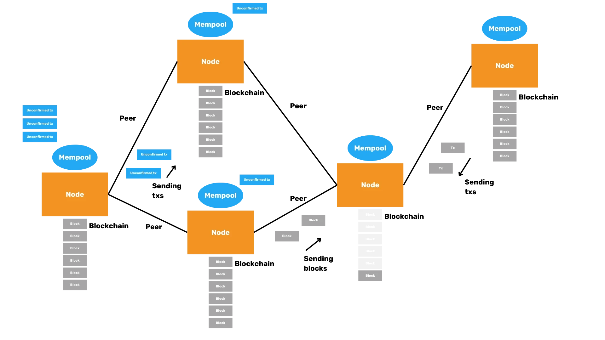

**NOTE**: The mempool is a temporary storage area for transactions that have been validated but not yet included on a block.

## Node Components

### Bitcoin Core Modules


- **Peer discovery**: Peer discovery is the process by which a node finds other nodes to connect to.
- **Validation engine**: The validation engine is responsible for checking the validity of transactions and blocks according to the network's rules.
- **RPC (Remote Procedure Call)**: Bitcoin Core includes an RPC interface that allows external applications, such as wallets, to interact with the node.
- **Storing blocks and Chain State**: Bitcoin Core can store the whole Blockchain or not, whether it's an archival or pruned node. It also stores the current state of the network (The UTXO set) on disk.

### What can we remove?
- **Miner**: Most Bitcoin nodes do not participate in mining due to the high computational power required.
- **RPC (Server)**: Bitcoin Core implements a JSON-RPC interface that can be accessed using the command-line helper bitcoin-cli.
- **Wallet (disablewallet)**: If you prefer to use an external wallet, you can disable the wallet functionality in Bitcoin Core. This allows you to manage your private keys separately.
- **Mempool (blocksonly)**: For users looking to minimize bandwidth usage, running a "blocksonly" node can be a solution where the node only processes blocks, ignoring transactions.

## Chain State

### Where are the coins?
The coins are not stored in addresses; they reside in UTXOs, which represent all outputs of transactions that haven't been spent. You can retrieve this information with the command:

```Bash
bitcoin-cli gettxoutsetinfo
```

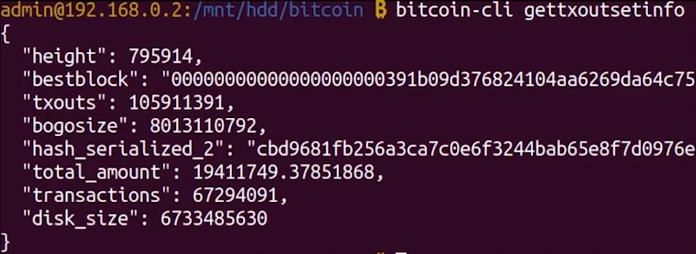

We can audit that the number of Bitcoins is correct.

### For each UTXO, chainstate has:
- Txid.
- Output index.
- Which block the UTXO is in.
- Whether it is a coinbase UTXO.

**IMPORTANT**: Transactions are not the same as UTXOs.


## Mempool
It's a list of unconfirmed transactions in each node, which are called candidate transactions. Stored in RAM for quick access and it's not part of the consensus.

## Security Considerations for Bitcoin Nodes
Security is paramount when running a Bitcoin node. Here are some key considerations to keep in mind:
### Avoiding Centralization
Relying on a single source for blockchain data, such as downloading all blocks from a central server, poses significant risks. To maintain the decentralized nature of Bitcoin, nodes should connect to multiple peers and validate the data they receive.

### Preventing Isolation Attacks
Isolation attacks occur when a node is tricked into connecting to a limited set of peers, allowing an attacker to feed it incorrect data. By connecting to a diverse set of peers and verifying the data received, nodes can protect themselves against these attacks.

### Managing Peer Connections
Nodes must carefully manage their peer connections to ensure they are not connecting to malicious actors. This includes maintaining a list of banned peers who have exhibited suspicious behavior and regularly updating the peer list to avoid relying on a small group of nodes.

### Importance of the UTXO Set
The UTXO set represents the current state of Bitcoin, listing all unspent transaction outputs. It is crucial for validating transactions and ensuring that coins are not spent more than once. Keeping this set small and easily accessible is important for maintaining the efficiency of the network.

## Conclusion
Running a Bitcoin node is a powerful way to participate in the Bitcoin network, providing you with the ability to verify transactions, maintain privacy, and contribute to the security and decentralization of the blockchain. Whether you choose to run a full node or customize your setup by pruning the blockchain or disabling certain components, understanding the core functions and security considerations of a Bitcoin node will empower you to make informed decisions and contribute to the ongoing evolution of Bitcoin.

## Bitcoin's Data Structures
<chapterId>5ed314b1-8293-567d-bf03-730e8c9c774b</chapterId>


## 1. Parsing Bitcoin Blocks and Transactions in Rust

### Objective

The primary goal of this lecture is to guide you through the process of parsing a Bitcoin block by coding a parser in Rust. This involves understanding the structure of Bitcoin blocks and transactions, and implementing the necessary logic to extract and interpret this data.

### Components to Parse

To parse a Bitcoin block, you'll need to focus on the following components:
1. **Block Header**
2. **Transactions within the Block**
3. **Transaction Inputs and Outputs**

### Block Header Structure

The block header is the cornerstone of a Bitcoin block and contains the following fields:
- **Version**: Indicates the version of the block.
- **Previous Block**: Reference to the previous block in the blockchain.
- **Merkle Root**: A hash representing the combined hash of all transactions in the block.
- **Timestamp**: The time at which the block was mined.
- **Bits**: The target threshold for a valid block hash.
- **Nonce**: The value that miners adjust to achieve a hash below the target threshold.
- **Transaction Count**: The number of transactions in the block.

**Note**: Only the first 80 bytes (comprising the block header) are hashed during mining.

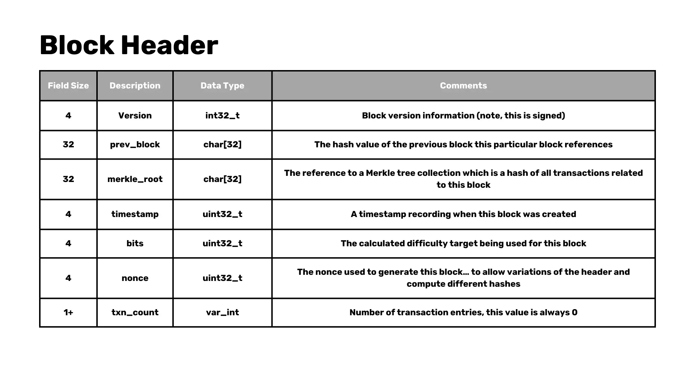

### Simplifications

To keep our example manageable:
- We will focus on parsing pre-SegWit (legacy) blocks, avoiding the added complexity of Segregated Witness.
- We will skip certain opcodes in the Bitcoin scripting language, focusing on a few that we need to parse a full block.

### Transaction Structure

Each transaction in a Bitcoin block contains the following:
- **Version**: The version of the transaction.
- **Number of Inputs**: Count of transaction inputs.
- **Inputs**: The list of the inputs.
  - **Previous output (outpoint)**: The previous output reference.
    - **Hash**: The hash of the referenced transaction.
    - **Index**: The index of the specific output in the transaction, called "vout".
  - **Script length**: The length of the signature script.
  - **Signature script**: Script for confirming transaction authorization.
  - **Sequence**: Transaction version as defined by the sender.
- **Number of Outputs**: Count of transaction outputs.
- **Outputs**: Contains Value and ScriptPubKey.
  - **Value**: Transaction value.
  - **PubKey Script length**: Length of the PubKey script.
  - **PubKey Script**: Contains the public key as a setup to claim the output.
- **Lock Time**: Indicates the block height or timestamp at which this transaction can be included in a block.


### Parsing Techniques

In Rust, we can use various techniques to parse these structures:
- Utilize `from_le_bytes` for reading Little Endian data.
- Implement a custom `parse` trait to handle the parsing logic for different structures.

```Rust
trait Parse: Sized {
    fn parse(bytes: &[u8]) -> Result<(Self, &[u8]), Error>;
}
```

- Implement parsing generically for lists and specific types such as `VarInt`, `U32`, `U64`, etc.

```Rust
impl Parse for i32 {
    fn parse(bytes: &[u8]) -> Result<(Self, &[u8]), Error> {
        let val = i32::from_le_bytes(bytes[0..4].try_into()?);
        Ok((val, &bytes[4..]))
    }
}
```

### Debugging and Testing

To ensure our parser works correctly:
- Compare parsed data against known block details (e.g., from mempool.space).
- Validate that parsed transaction counts and block details match expected values.

## 2. Handling Special Cases and Script Parsing

### Implementation of 'parse' Function

We will implement the `parse` function to handle the full block, including the block header and transactions. This involves reading the block data and extracting the relevant fields.

```Rust
impl Parse for Block {
    fn parse(bytes: &[u8]) -> Result<(Self, &[u8]), Error> {
        let (header, bytes) = Parse::parse(bytes)?;
        let (transactions, bytes) = Parse::parse(bytes)?;

        let block = Block {
            header, transactions
        };

        Ok((block, bytes))
    }
}
```

### Block Header Modification

We need to adjust our parsing logic to remove the transaction count from the block header structure, treating it as a separate entity.

```Rust
impl Parse for BlockHeader {
    fn parse(bytes: &[u8]) -> Result<(Self, &[u8]), Error> {
        let (version, bytes) = Parse::parse(bytes)?;
        let (prev_block, bytes) = Parse::parse(bytes)?;
        let (merkle_root, bytes) = Parse::parse(bytes)?;
        let (timestamp, bytes) = Parse::parse(bytes)?;
        let (bits, bytes) = Parse::parse(bytes)?;
        let (nonce, bytes) = Parse::parse(bytes)?;

        let header = BlockHeader {
            version, prev_block, merkle_root, timestamp, bits, nonce,
        };

        Ok((header, bytes))
    }
}
```

### Structure Definition

Define a new structure `Block` that contains both the block header and a list of transactions.

```Rust
struct Block {
    header: BlockHeader,
    transactions: Vec<Transaction>,
}
```

### Rust Syntax Elements

Introduce Rust syntax elements such as the question mark (`?`) for error handling. This will simplify our code and make it more readable.

### Assertions

Add assertions to verify that no bytes are left unparsed after processing a full block. This ensures the integrity of our parsing process.

### Special Cases like Coinbase Transactions

Coinbase transactions, which are the first transaction in a block used to claim the block reward, have unique characteristics. We need to handle these special cases appropriately.

```Rust
struct OutPoint {
    txid: [u8; 32],
    vout: u32,
}

impl OutPoint {
    fn is_coinbase(&self) -> bool {
        self.txid == [0; 32] && self.vout == 0xFFFFFFFF
    }
}
```

### Script Parsing Strategy

To parse the script in transactions, we will focus on common opcodes such as `OP_CHECKSIG`, `OP_HASH160` and `OP_PUSH`. Parsing these scripts is crucial for validating transactions and handling errors.

```Rust
enum OpCode {
    False,
    Return,
    Dup,
    Equal,
    CheckSig,
    Hash160,
    EqualVerify,
    Push(Vec<u8>),
}

impl Parse for OpCode {
    fn parse(bytes: &[u8]) -> Result<(Self, &[u8]), Error> {
        match bytes[0] {
            v @ 1..=75 => {
                let data = bytes[1..(v as usize + 1)].iter().cloned().collect();
                Ok((OpCode::Push(data), &bytes[(v as usize + 1)..]))
            },
            76 => {
                let len = bytes[1] as usize;
                let data = bytes[2..(len + 2)].iter().cloned().collect();
                Ok((OpCode::Push(data), &bytes[(len + 2)..]))
            },

            0 => Ok((OpCode::False, &bytes[1..])),

            106 => Ok((OpCode::Return, &bytes[1..])),
            118 => Ok((OpCode::Dup, &bytes[1..])),
            135 => Ok((OpCode::Equal, &bytes[1..])),

            136 => Ok((OpCode::EqualVerify, &bytes[1..])),
            169 => Ok((OpCode::Hash160, &bytes[1..])),
            172 => Ok((OpCode::CheckSig, &bytes[1..])),

            _ => todo!()
        }
    }
}
```


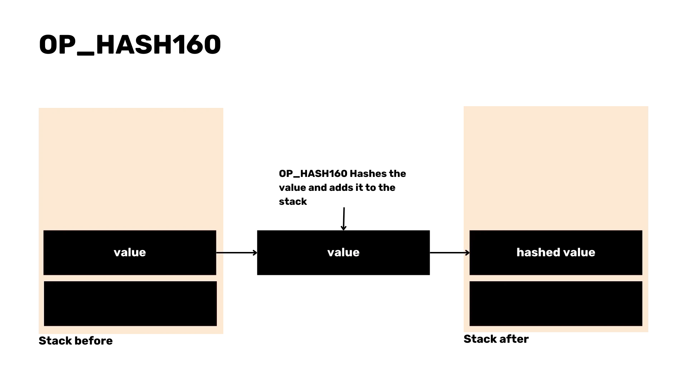


### Challenges in Script Parsing

Script parsing can present challenges, particularly with coinbase transactions. It's important to account for edge cases and handle them correctly to ensure accurate parsing.

```Rust
impl Parse for Script {
    fn parse(bytes: &[u8]) -> Result<(Self, &[u8]), Error> {
        let (len, bytes) = VarInt::parse(bytes)?;
        let mut script_bytes = &bytes[..len.0 as usize];
        let mut opcodes = Vec::new();
        while !script_bytes.is_empty() {
            let (opcode, bytes) = OpCode::parse(script_bytes)?;
            script_bytes = bytes;
            opcodes.push(opcode);
        }

        Ok((Script(opcodes), &bytes[len.0 as usize..]))
    }
}
```

### Compact Blocks

The use of compact blocks are currently used to enhance the efficiency of data transmission between nodes. This reduces bandwidth usage and speeds up synchronization by sending the transactions that weren missing in the mempool, filling them with the transaction the node already had in a block, and then validating it.

### Use of Existing Libraries

For consensus-critical applications, it is recommended to use existing libraries to avoid bugs and ensure security like [rust-bitcoin](https://docs.rs/bitcoin/latest/bitcoin/)  or [bitcoin-dev-kit](https://docs.rs/bdk/latest/bdk/). Implementing your own parser can be educational but also risky in production environments.


## 3. Efficiency and Security in Bitcoin Mining

### Efficiency in Mining

Mining empty blocks can be more efficient for miners:
- Miners start mining empty blocks to save time.
- Empty blocks can be mined quickly before switching to a full block once the previous block is confirmed.

### Reasons for Mining Empty Blocks

Empty blocks are sometimes mined due to timing issues. Miners might not have received the full list of transactions by the time they start mining the next block, so they choose to mine an empty block instead.

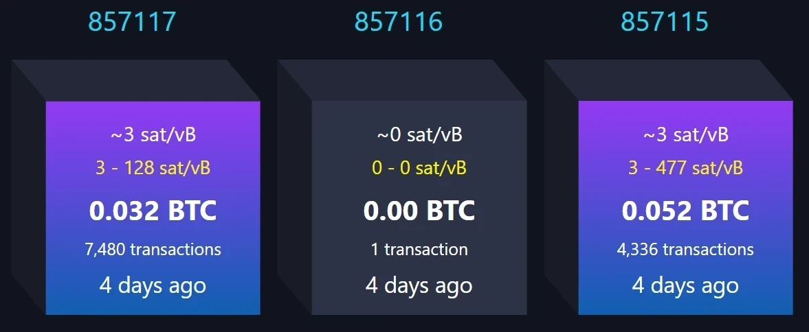

### Malicious Mining of Empty Blocks

While malicious mining of empty blocks is possible, it has not been observed. The primary reason for empty blocks is the timing constraint rather than malicious intent.

### Implications of Empty Blocks

The occurrence of empty blocks is a normal aspect of the mining process and is primarily due to timing issues. While they do not contain transactions, they still extend the blockchain and contribute to network security.

### Importance of Security

Security in Bitcoin mining is paramount. By adhering to best practices and using well-vetted libraries, miners and developers can ensure the integrity of the blockchain and protect against potential vulnerabilities.

In conclusion, parsing Bitcoin blocks and transactions in Rust involves understanding complex structures and implementing efficient parsing techniques. Handling special cases and script parsing requires careful consideration, and focusing on efficiency and security ensures the robustness of the Bitcoin network.

## Bitcoin L1 Software Stack
<chapterId>96d64781-fc27-5209-88d8-2acf00d05ea8</chapterId>


# Bitcoin Software Overview and Node Implementations

## Introduction
Daniela Brozzoni offers a comprehensive overview of the Bitcoin Layer 1 software stack, explaining the layers that comprise the foundation of Bitcoin's protocol (ie. Bitcoin nodes and Bitcoin wallets) and how to build Bitcoin software with an introduction to Bitcoin libraries and a deep dive into Bitcoin Development Kit (BDK).

## Bitcoin Software Overview

Bitcoin's software stack is fundamental to its operation and is composed of various elements, including nodes and wallets. A critical part of this ecosystem is the Bitcoin Development Kit (BDK), which we will explore in detail later. First, let's focus on the role of nodes within the Bitcoin network.

### Bitcoin Nodes

Bitcoin nodes are the backbone of the Bitcoin network. They connect to each other, exchange transactions and blocks, and validate incoming data. There are different types of nodes, each serving a unique purpose:

- **Full Nodes**: These nodes store the entire blockchain and validate all transactions and blocks. They provide a high level of security and are essential for the network's decentralization.

    - **Archival Nodes**: A subset of full nodes, archival nodes retain all blockchain data, making them valuable for historical analysis and debugging.

    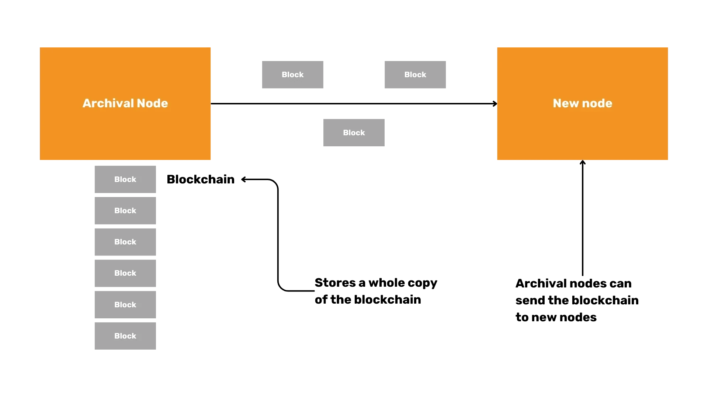

    - **Pruned Nodes**: Pruned nodes save disk space by keeping only a portion of the blockchain, eliminating older data that is no longer needed for validation.

    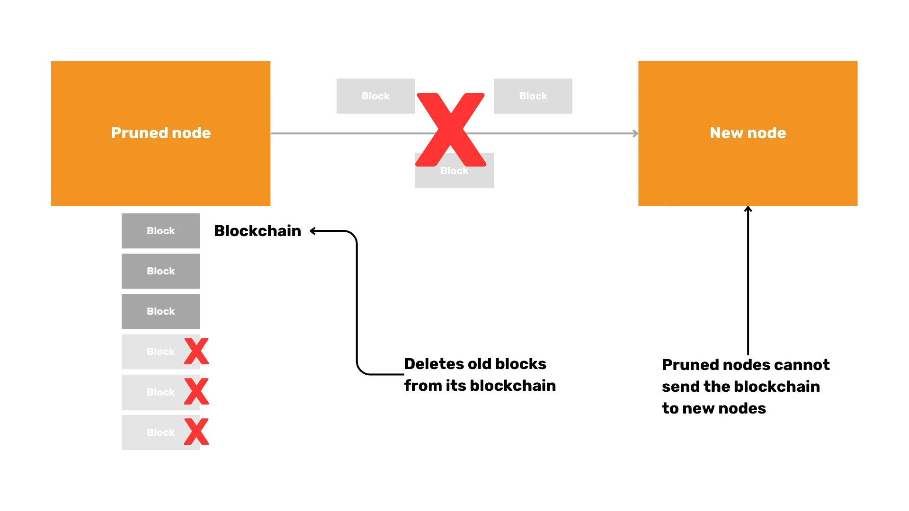


### Bitcoin Core

Bitcoin Core is the most widely used full node implementation. It performs dual functions as both a full node and a wallet. Key aspects of Bitcoin Core include:

- **Usability**: It can be utilized via a Command Line Interface (CLI) and a graphical user interface (GUI).
- **Open-Source Nature**: The code is open-source, allowing developers to contribute and scrutinize its workings.
- **Language**: Written in C++ with tests in Python, ensuring robust performance and reliability.

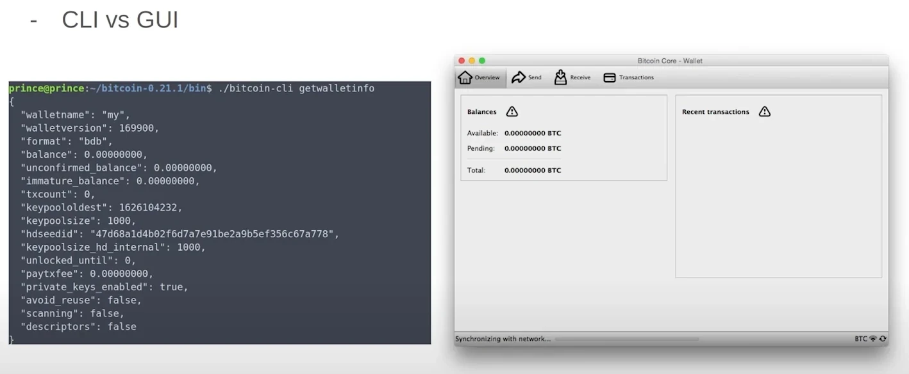

#### Exploring Bitcoin Core

To get hands-on experience with Bitcoin Core, one can compile and run tests using Git. This process involves:

- Compiling the codebase to create an executable version. [bitcoin github](https://github.com/bitcoin/bitcoin) access to doc/build-*.md for instructions. 

```Bash
./autogen.sh
./configure
make # use "-j N" for N parallel jobs
make install # optional
```

- Running tests to ensure everything functions correctly. Instructions can be found [here](https://github.com/bitcoin/bitcoin/blob/master/test/README.md)

```Bash
make check

#individual tests can be run directly calling the test script e.g:
test/functional/feature_rbf.py

#run all possible tests
test/functional/test_runner.py
```

- Creating and executing a test in Python to validate specific functionality. The file [example.py](https://github.com/bitcoin/bitcoin/blob/master/test/functional/example_test.py) is a heavily commented example of a test case that uses both the RPC and P2P interfaces.

### Alternative Node Implementations

Beyond Bitcoin Core, there are several alternative node implementations:

- **Bitcoin Knots**: It offers more advanced features than Bitcoin core, taking more space and memory.
- **LibBitcoin**: A flexible and modular implementation.
- **btcd**: Written in Go, it offers different design philosophies.

Implementing these alternatives comes with its own risks, particularly regarding the consensus rules. Deviating from established validation rules can lead to forks or inconsistencies. The Bitcoin Kernel project seeks to mitigate these risks by centralizing consensus code, ensuring uniformity across implementations.


# Bitcoin Wallets and Security

Bitcoin wallets are crucial for managing your Bitcoin holdings securely. They come in various forms, each with distinct features and security considerations.

### Types of Bitcoin Wallets

1. **Custodian vs. Non-Custodian**: 
   - **Custodian Wallets**: Managed by third parties, offering convenience but requiring trust in the custodian.
   - **Non-Custodian Wallets**: Controlled by users, providing higher security and privacy.

2. **Desktop vs. Mobile**: 
   - **Desktop Wallets**: Typically more feature-rich and secure.
   - **Mobile Wallets**: Offer convenience and portability.

3. **On-Chain vs. Lightning**: 
   - **On-Chain Wallets**: Interact directly with the Bitcoin blockchain.
   - **Lightning Wallets**: Facilitate faster and cheaper transactions off-chain.

4. **Cold Wallets vs. Hot Wallets**:
   - **Cold Wallets**: Not connected to the internet, providing superior security against hacks.
   - **Hot Wallets**: Connected to the internet, offering more accessibility but less security.

### Cold Wallet Security

Cold wallets are revered for their security. By remaining offline, they are inherently resistant to online hacks. However, it is crucial to ensure that transactions performed through cold wallets are secure and accurate to prevent inadvertently sending Bitcoin to malicious actors.

### Watch-Only Wallets

Watch-only wallets contain only public keys, allowing users to receive Bitcoin and monitor their balance without the ability to spend. This feature adds an extra layer of security for those who need to keep a close eye on their holdings.

### Basic Functions of a Bitcoin Wallet

Regardless of type, every Bitcoin wallet performs three fundamental functions:

1. **Receive Bitcoin**: Generate addresses and monitor for incoming transactions.
2. **Send Bitcoin**: Create and broadcast transactions to the network.
3. **Display Balance**: Show the current balance of the wallet.

### Role of Bitcoin Wallets

- Bitcoin wallets act as keychains, holding and generating cryptographic keys.

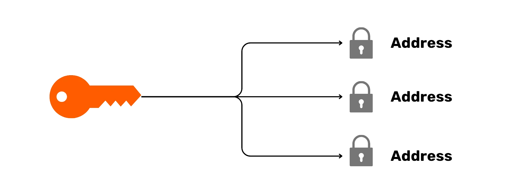

- They monitor the blockchain for incoming transactions.

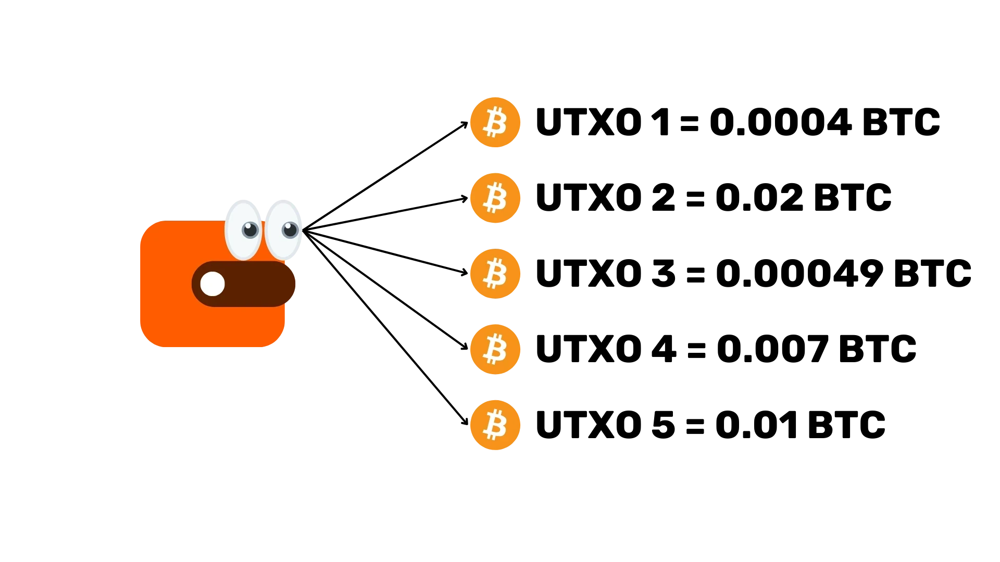

- Create transactions by selecting unspent transaction outputs (UTXOs), setting inputs and outputs, and optimizing for privacy and fees.


### Reusability of Wallet Logic

Given that all Bitcoin wallets share similar functions, rewriting wallet logic repeatedly is inefficient. This is where the Bitcoin Development Kit (BDK) comes into play.

## Bitcoin Development Kit (BDK) and Technical Concepts

The Bitcoin Development Kit (BDK) is a library designed to simplify the creation and management of Bitcoin wallets.

### Overview of BDK

BDK simplifies wallet creation by providing higher-level functionality built on top of Rust Bitcoin. It supports multiple programming languages through bindings, including Kotlin, Swift, and Python.

### Other Bitcoin Libraries

Numerous Bitcoin libraries cater to different programming languages, such as Python, JavaScript, Java, Go, and C. These libraries offer diverse tools for Bitcoin development.

### Key Technical Concepts

1. **Descriptors**: Descriptors describe how to derive Bitcoin scripts and addresses from keys, allowing for more flexible and powerful wallet functionalities.
2. **PSBT (Partially Signed Bitcoin Transactions)**: PSBT is a format for transactions that require multiple signatures, facilitating collaborative transactions and enhanced security.
3. **Rust Syntax**: Key concepts in Rust, such as `Option` for null safety and the `Result` type for error handling, are integral to understanding and using BDK effectively.

### Creating and Managing Transactions

BDK streamlines the process of building, signing, and broadcasting transactions:

1. **Build Transactions**: Specify recipients, amounts, and fees.
2. **Sign Transactions**: Use PSBT to gather signatures.
3. **Broadcast Transactions**: Send finalized transactions to the network.

### Example Workflow in BDK

- **Set Up Wallet**: Initialize a wallet with descriptors.

```Rust
use bdk::{Wallet, SyncOptions};
use bdk::database::MemoryDatabase;
use bdk::blockchain::ElectrumBlockchain;
use bdk::electrum_client::Client;
use bdk::bitcoin;

fn main() -> Result<(), bdk::Error> {
  let wallet = Wallet::new(
    "tr(tprv8ZgxMBicQKsPf6WJ1Rr8Zmdsr6MaACS5K3tHw3QDQmFbkEsdnG3zAZzhjEgEtetL1jwZ5VAL85UaaFzUpAZPrS7aGkQ3GdM75xPu4sUxSiF/*)",
    None,
    bitcoin::Network::Testnet,
    MemoryDatabase::default(),
  )?;

  Ok(())
}
```

- **Generate Addresses**: Create new addresses to receive Bitcoin from a testnet faucet.

```Rust
//import AddressIndex outside the main function
use bdk::wallet::AddressIndex;

  //Function to add isnide main function
  let address = wallet.get_address(AddressIndex::New)?;

```

- **Check Balance**: Monitor the wallet's balance, first by connecting to electrum, syncing wallet and getting the balance from the wallet.

```Rust
    //connect to Electrum server and save the blockchain
    let client = Client::new("ssl://electrum.blockstream.info:60002")?;
    let blockchain = ElectrumBlockchain::from(client);

    //sync wallet to the blockchain received
    wallet.sync(&blockchain, SyncOptions::default())?;

    //get the balance from your wallet
    let balance = wallet.get_balance()?;
    println!("This is your wallet balance: {}", balance);
```

- **Build, Sign, and Broadcast Transactions**: Construct and finalize transactions, then broadcast them to the network.

```Rust
//Add to the imports
use bdk::bitcoin::Address;
use bdk::{SignOptions};
use std::str::FromStr;
use bdk::blockchain::Blockchain;

    //build a transaction psbt
    let mut builder = wallet.build_tx();
    let recipient_address = Address::from_str("tb1qlj64u6fqutr0xue85kl55fx0gt4m4urun25p7q").unwrap();

    builder
        .drain_wallet()
        .drain_to(recipient_address.script_pubkey())
        .fee_rate(FeeRate::from_sat_per_vb(2.0))
        .enable_rbf();
    let (mut psbt, tx_details) = builder.finish()?;
    println!("This is our psbt: {}", psbt);
    println!("These are the details of the tx: {:?}", tx_details);

    //Sign the PSBT
    let finalized = wallet.sign(&mut psbt, SignOptions::default())?;
    println!("Is my PSBT Signed? {}", finalized);
    println!("This is my PSBT finalized: {}", psbt);

    
    let tx = psbt.extract_tx();
    let tx_id = tx.txid();
    println!("this is my Bitcoin tx: {}", bitcoin::consensus::encode::serialize_hex(&tx));
    println!("this is mny tx id: {}", tx_id);

    //Broadcast the transaction
    blockchain.broadcast(&tx)?;
```

### Print TXID and Broadcast Transaction

Assigning and printing the Transaction ID (TXID) allows monitoring on platforms like mempool.space. Broadcasting the transaction can be accomplished using the `Blockchain.broadcast` method, and verifying the transaction's details and status is crucial for ensuring successful propagation.

### BDK Utility and Privacy Considerations

The BDK is invaluable for simplifying Bitcoin wallet development. For enhanced privacy, tools like Electrum, Explora, and personal Bitcoin Core nodes are recommended.

### Programming Languages

When developing Bitcoin projects, Rust is often preferred due to its safety and efficiency. However, the choice of language may vary based on specific project requirements and developer expertise.

### BDK Dependencies

BDK relies on several key dependencies, including Rust-Bitcoin and Rust-Miniscipt. Additional libraries may be employed for database management and cryptography.

---

By understanding these components, from Bitcoin nodes and wallets to the Bitcoin Development Kit (BDK), you can navigate the Bitcoin ecosystem with greater confidence and competence. This knowledge empowers you to develop robust and secure Bitcoin applications, contributing to the ongoing evolution of this revolutionary technology.

# Lightning Network
<partId>d7ac2ad7-a4b3-564f-8a8d-cfec5297b3a5</partId>

## History of Payment Channels
<chapterId>a0b11c6e-c0ff-5e65-b809-b2ab9a2fc37b</chapterId>


Gabriel Comte provides a historical perspective on the development of payment channels, which are fundamental to the Lightning Network. This chapter explores the evolution of payment channels and their significance in scaling Bitcoin transactions, from Satoshi's payment channels to bi-directional payment channel solutions like Duplex Micropayment Channels or Lightning payment channels.

## History of Atomic Routing
<chapterId>28be7b31-e6b2-5eea-a5ed-62ce0a154b6e</chapterId>


Gabriel Comte recounts the history of atomic routing, detailing several techniques that have been on the foundation of the routing layer of lightning network like Hub-and-Spokes model, Ripple model and Hashed TimeLocked Contracts (HTLCs). This history has been pivotal in enabling secure, trustless transactions across the Lightning Network.

## BOLT Review
<chapterId>ba4b09ae-81de-53f2-8c15-316f037aaea9</chapterId>


asi0 reviews BOLT, the Basis of Lightning Technology, explaining the specifications that any Lightning Network implements must respect. This will be a first deep dive into the different layers of the Lightning Network.

## Major LN Clients
<chapterId>a2ad8db4-aea2-5231-927c-616c53db31bf</chapterId>


asi0 introduces the major Lightning Network (LN) clients, providing an analysis of their features, strengths based on a 2x2 matrix that evaluates the level of custody and liquidity management that the user has with LN clients.

# The Challenges of LN
<partId>ca58c9d7-ba7e-5392-8488-6a21a9850e6a</partId>

## Practical Challenges to LN
<chapterId>014c7c40-aef7-58ac-b51f-33784463f482</chapterId>

(the video will be available soon)

asi0 addresses the practical challenges faced when working with the Lightning Network. This includes a discussion about the current limitations and the ongoing efforts to overcome them based on 4 main challenges (liquidity management, L1/L2 abstraction, receiving offline, and backup management) that are explored from the point of view of the user and from the point of view of the developper

## LN Future Evolution
<chapterId>c06763dd-bb26-5fec-8ac4-3e446e9517cd</chapterId>


Gabriel Comte speculates on the future evolution of the Lightning Network, examining potential developments -- like dual-funded channels eltoo, BOLT 12, PTLCs, Watchtowers and LSP standards -- and how they could transform the landscape of Bitcoin transactions.

## Protocols on top of LN
<chapterId>f4d147bb-f146-5b36-a994-b9b70da83744</chapterId>


Alekos Filini examines the protocols built on top of the Lightning Network, explaining how they contribute to the scalability and functionality of Bitcoin.

# Bonus
<partId>4c5c74d7-40a9-5292-9b82-e3f3d79875e1</partId>

## Bitcoin Mining Essentials
<chapterId>a4eacfc3-7b37-5fa3-abd1-b1fc48b645f0</chapterId>


## Introduction

Ajelex focuses on the business aspect of Bitcoin mining, examining strategies for maintaining profitability in a competitive market. The discussion includes an analysis of operational costs, efficiency measures, and the economics driving the mining industry.

## 1. Mining Complexity and Profitability Factors

### Technical and Strategic Factors

Mining complexity in the context of Bitcoin primarily involves the technical and strategic elements that determine the profitability of mining operations. It's crucial to understand that mining is not just a game of chance but a sophisticated process that requires careful planning and continuous optimization.

### Key Profitability Factors


1. **Electricity Costs**: One of the most significant factors affecting mining profitability is the cost of electricity. In regions like France, electricity can be relatively expensive compared to countries like El Salvador, where lower costs provide a competitive edge for miners.
2. **Hardware Efficiency**: The efficiency of mining hardware, measured by its hash rate and power consumption, plays a pivotal role. Advanced ASIC miners like the S19J Pro are far more efficient than older models such as the Antminer S9.
3. **Time period**: Bitcoin mining encourages long-term planning.
4. **BTC Price**: The BTC Price is essential to determine the mining profitability.
5. **Network difficulty**: The network difficulty represents the amount of hashrate in average needed to mine a block in 10 minutes.
6. **Strategic Tools**: Tools like [braiins.com](https://insights.braiins.com) are invaluable for calculating profitability and helping miners make data-driven decisions.

### Practical Application

From personal experience, I've even used mining to heat my apartment in France, creatively offsetting electricity costs while mining Bitcoin. This example underscores the practicality of integrating mining operations into everyday life for added benefits.

### Bottlenecks in Mining

Miners face three primary bottlenecks: hardware availability, energy access, and the capital required to sustain operations. The scarcity of ASICs due to high demand often leads to long wait times and inflated prices, further complicating the mining landscape.

- Example of **Energy bottleneck**.
    In 2021, the Chinese government banned mining within its territory, causing mining companies in China to lose access to energy. This resulted in a **50%** drop in the hashrate over two weeks.


---

## 2. Evolution and Efficiency of Mining Hardware

### Historical Evolution

The journey of mining hardware has been monumental, starting from simple CPU mining to the highly specialized ASIC miners we use today.


1. **CPU Mining**: In the early days, mining was performed using regular computer processors (CPUs). This method was quickly outpaced as the network grew.
2. **GPU Mining**: Graphics Processing Units (GPUs) provided a significant boost in mining efficiency, making CPUs obsolete for mining purposes.
3. **FPGA Mining**: Field-Programmable Gate Arrays (FPGAs) offered even better performance and energy efficiency than GPUs.
4. **ASIC Mining**: Application-Specific Integrated Circuits (ASICs) represent the pinnacle of mining hardware efficiency, designed specifically for mining operations with unparalleled performance.

### Detailed Comparison: S19J Pro vs. Antminer S9

- **S19J Pro**: Known for its high efficiency and reliability, the S19J Pro offers a superior hash rate with lower power consumption, making it ideal for large-scale operations.
- **Antminer S9**: While older and less efficient, the Antminer S9 remains popular for smaller setups and hobbyists due to its affordability and decent performance.


### Mining Efficiency and Learning

Mining not only provides financial rewards but also valuable hands-on experience. Acquiring KYC-free bitcoins through mining can be an attractive proposition for those concerned about privacy.

### Advanced Tools and Techniques

Aftermarket software can enhance the efficiency and functionality of mining hardware. Tools that offer optimization and auto-tuning capabilities ensure that each chip operates at maximum efficiency, balancing hash rate and power usage effectively.

---

## 3. Regulatory and Market Dynamics in Mining Operations

### Regulatory Impact

Regulation plays a significant role in shaping the mining landscape. For instance, the Chinese mining ban had profound effects on global mining operations, causing a significant drop in the network hash rate and leading to a redistribution of mining power across different regions.

### Market Dynamics

1. **Hardware Availability and Cost**: The price and availability of ASIC miners are influenced by Bitcoin's market price. High demand during bull markets results in scarcity and inflated prices.
2. **Hash Value and Hash Price**: Understanding the distinction between hash value (satoshis earned per terahash per day) and hash price (monetary value of the hash rate) is essential. Both are impacted by network difficulty and Bitcoin's market price.

### Mining Pools and Reward Mechanisms

1. **Mining Pools**: By combining resources, mining pools provide more stable rewards, reducing the variance and risk associated with solo mining.
2. **Reward Schemes**: Different reward mechanisms, like Pay-Per-Share (PPS) and proportional rewards, offer various risk and reward profiles for miners.
    - **Pay per share**: Pay-Per-Share rewards miners for each valid share they submit, regardless of whether the pool finds a block. **Shares** are units of proof that miners have completed the required work, and the pool verifies these shares.

    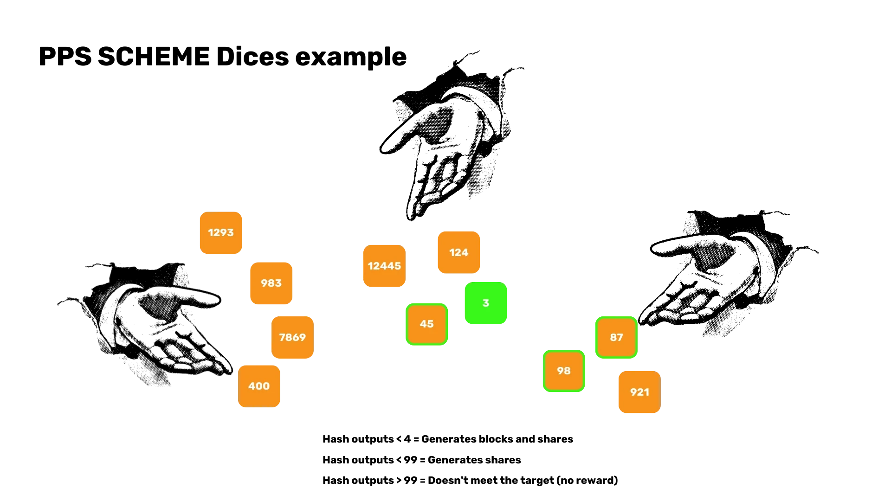

    - **Proportional**: It depends on the pool mining a block to distribute the reward equally to the contribution of the miner to the total hashrate of the pool.

    

### Future of Mining

As block rewards diminish, miners will increasingly rely on transaction fees. This shift raises concerns about whether transaction fees alone will provide sufficient incentives for miners to continue securing the network.

### Hosted Mining

Hosted mining services can offer lower operational costs but come with risks such as lack of control and potential for fraud. Proper due diligence is necessary to mitigate these risks.

### Security and Efficiency

Advanced security protocols and the use of renewable energy not only enhance profitability but also contribute to the sustainable growth of the mining ecosystem.

---

In conclusion, the world of Bitcoin mining is a complex, multifaceted domain that requires a deep understanding of technical, strategic, regulatory, and market dynamics. Whether you're a seasoned miner or just starting, staying informed and adaptable is key to thriving in this ever-evolving field. Thank you for your attention, and I look forward to your questions and discussions.

## Understanding Joinmarket
<chapterId>f109f64f-9b73-5fbf-8870-5d34d5b69df8</chapterId>


Adam Gibson offers insight into Joinmarket, detailing how this CoinJoin implementation enhances Bitcoin's privacy and fungibility. He discusses how Joinmarket facilitates collaborative, trustless, and anonymous transactions within the Bitcoin ecosystem. Then in a second part, he show how to run Joinmarket in Signet.

## Cubo+ first year Hackathon
<chapterId>3faf7daa-ea42-5b68-bcaf-04b70b2e02dd</chapterId>

### Groupe 1 Hackathon - The Satoshi Legacy


The Satoshi Legacy's group presents their work on building a Lightning e-commerce with Shopify, React JS and Hydrogen and the IBEX payment gateway.

### Groupe 2 Hackathon - Honey Badger


Honey Badger's group presents her solution for a blog with Lightning Powered Micropayments built-in with the use of LnBits and Next.js, Node.js and Hydrogen.

### Groupe 3 Hackathon


The third group presents a Lightning Network Node Dashboard via a customed API, LND, vue.js, node.js, Bootstrap.

### Groupe 4 Hackathon - Satoshi Fellowship


Satoshi's Fellowship's group presents a LN gaming app using LnBits and MongoDB, Poetry, Node.js.

### Groupe 5 Hackathon - Lighting Walker


Lightning Walker's group presents their solution for Remittances Service using MySQL, JavaScript and ZDB's API.

## Acknowledgments
<chapterId>33cb95cf-91d1-555b-a33b-0e3bd6745c33</chapterId>

We'd like to acknowledge the contributions of our educators:

- Peter Todd
- Adam Gibson
- Alekos Filini
- Daniela Brozzoni
- Ajelex
- asi0
- Gabriel Comte

Their expertise has been invaluable to the success of this course. This has been the first course based on the 1st edition of the Cubo+ initiative, conducted in July 2023. Thank you to all participants and educators for being a part of this pioneering educational journey. It marks the beginning of what we hope will be a long and fruitful journey into the world of Bitcoin development. As the first cohort, your participation has set the standard for future classes.

Continue to explore, learn, and contribute to the Bitcoin ecosystem. The knowledge gained here is just a starting point. Keep digging the rabbit hole, and you'll discover an ever-expanding world of opportunities.
