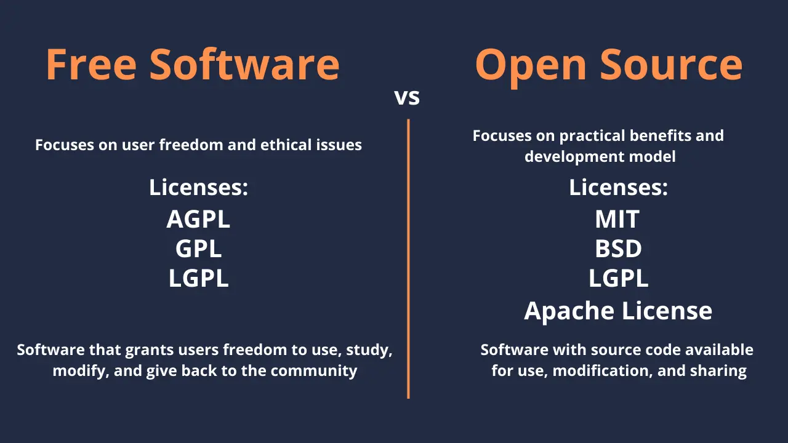
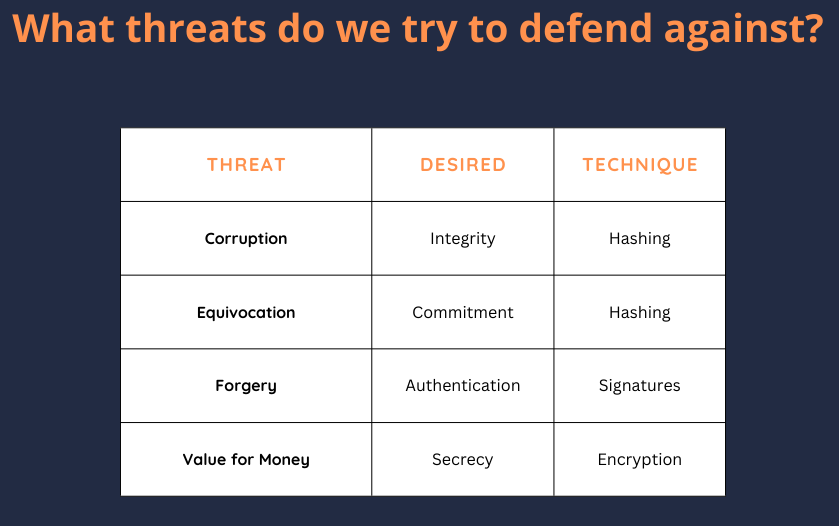
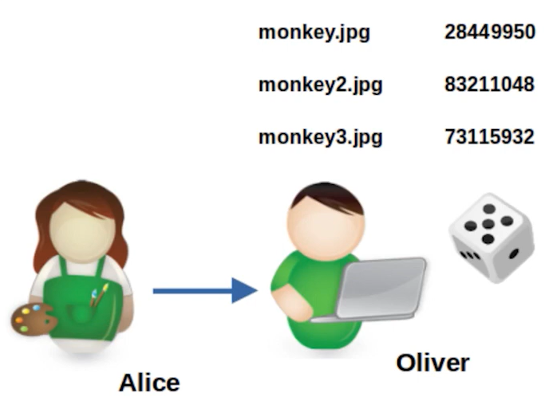
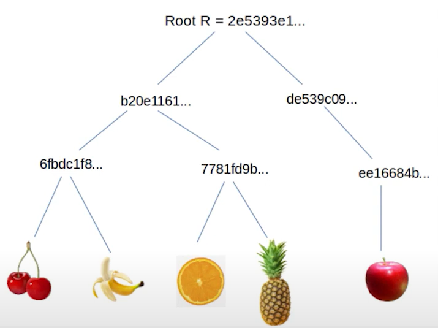
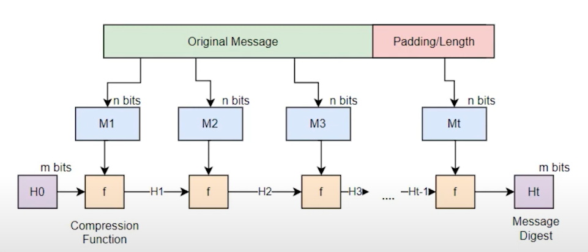
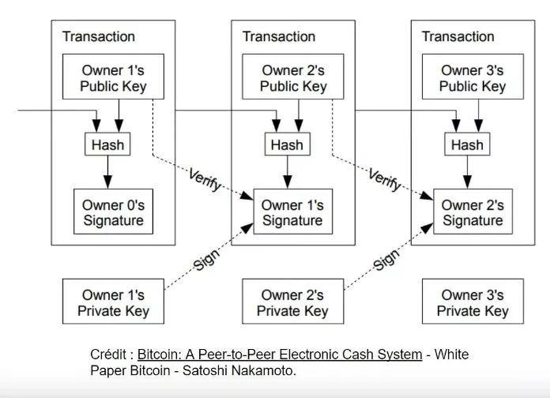

Welcome to the Cubo+ development courses for Bitcoin!

Over the next 20 hours, you will dive deep into the BTC and LN protocols. This course is designed for programmers who want to start working in the BTC ecosystem and are seeking a solid understanding of the different technology stacks of BTC and LN.

The videos were recorded live during the CUBO+ 2023 bootcamp in El Salvador and succeeded in bringing together world-renowned teachers. This course was offered for free thanks to the generosity of Fulgure Venture and the collaborative efforts of the teachers, the Bitcoin office, DecouvreBitcoin, and many other actors.

Enjoy!

+++

# Introduction and preparatory courses
<partId>43a835de-c4e7-542b-9d1a-c92f049e88e6</partId>

## Introduction to CUBO+ courses
<chapterId>dcf2d37e-b32a-5eb8-aaa3-41ac92475ba9</chapterId>

Filippo and Mario provide an introductory talk on CUBO+, setting the stage for the comprehensive learning journey that awaits. They discuss the structure of the courses, the learning outcomes, and how these will empower students in the Bitcoin development space.

### Objectives

The course aims to equip participants with a deep understanding of Bitcoin's underlying principles, practical development skills, and the ability to navigate and contribute to the Bitcoin ecosystem effectively. Through a blend of theoretical knowledge and practical exercises, students will master the essentials of Bitcoin security, the intricacies of its software stack, and the mechanisms of its governance.

### Prerequisite

Participants are expected to bring a strong sense of curiosity, an eagerness to learn at a professional level, and some foundational knowledge in development. While a detailed background in Bitcoin is not required, a basic understanding of coding principles and an openness to engaging with complex technical concepts are essential for making the most of the accelerator.

## Why Bitcoin
<chapterId>89a0aa8b-90bd-58b2-82b3-bc5e1f82eaeb</chapterId>

### Why El salvador needs Bitcoin

The first lecture ‘Why El Salvador needs Bitcoin’ provides an overview of: the Bitcoin protocol and its roots, the cypherpunk movement, and the importance of Bitcoin as a tool of freedom (uncensored money, financial inclusion, and other related topics).

### Cyperpunk movement and austrian economics

In our second lecture 'Cypherpunk movement and Austrian Economics', we delved deeper into the Cypherpunk philosophy introduced by Rikki in the previous lecture.

Also, our discussion centered on the Austrian School of Economics, which distinguishes itself from the current financial system (Keynesian Economics).
We explored concepts such as scarcity, time preference, durability and saving, which Saifedean will delve into further. To prepare for his lecture, I recommend reading The Bitcoin Standard (you can find it in 'Additional Resources'), or at least a few chapters.

It is important to note that the first module, 'Why Bitcoin', was necessary to comprehend the roots and goals before moving on to 'How Bitcoin', where we will discover the Bitcoin's technological stack and tradeoffs early developers made in the protocol.
Here is the link, enjoy!

## How Bitcoin
<chapterId>d800970a-0d8e-5557-810a-7aef845d4a34</chapterId>

### Bitcoin's Technology Stack

In the first lecture of 'How Bitcoin' course, we began exploring the technology stack that underpins the Bitcoin network. We covered a range of topics, including Hashcash, transactions, the blockchain, Lightning Network and other key components of the Bitcoin protocol.

### Bitcoin's Technological Stack

During the second lecture of 'How Bitcoin', we conducted a more in-depth examination of Bitcoin's technology stack.

## Debunk Bitcoin
<chapterId>171ec71d-3028-5820-9b4f-36682113fc81</chapterId>

### Cut the FUD

Debunking blockchains and shitcoin and Debunking myths and misconceptions about Bitcoin’s energy waste, and criminal usage

## Running Bitcoin
<chapterId>5f638ec9-a6c1-5716-b27f-d837ab896eb1</chapterId>

### Installation of Bitcoin Core

In the first lecture of the 4th module we explored the Bitcoin's architecture and installation of a Bitcoin Core node

### Installation of C-lightning

During our second lecture, we delved into the process of installing c-lightning

### Security and Hardware devices

In third lecture, we covered topics related to security, hardware devices, and the configuration of Specter

## Imrpoving Bitcoin
<chapterId>4fdd032f-2b05-5f24-a094-297d64f939de</chapterId>

### Open Problems in the Bitcoin ecosystem

Hey guys, here is the link for the last lecture of the preparatory period about Bitcoin problems and potential solutions

# Bitcoin Fundamentals
<partId>6c0a3691-3ce4-5309-8ad7-e16e4b63c734</partId>

## Security Thinking in Bitcoin
<chapterId>0b97af0c-015a-54e3-a7f0-0f62ceb96c07</chapterId>

Welcome to today's lecture on **Security and Reliability**. Our objective is to explore the nuanced relationship between these two fundamental aspects of system design and application in real-world scenarios. 

### Introduction to Security Thinking

Security thinking is grounded in principles designed to protect systems from intentional attacks. It involves identifying potential threats and implementing measures to mitigate them. In contrast, reliability focuses on ensuring systems function correctly under specified conditions, accounting for probabilistic failures rather than deliberate attempts to breach security.

### Relationship Between Security and Reliability

While both security and reliability aim to maintain system integrity, their approaches differ significantly. Reliability engineering deals with the likelihood of system failures due to random events and often employs statistical methods to predict and mitigate these failures. On the other hand, security must consider the deliberate and intelligent nature of attacks, requiring a multi-layered defense strategy known as "defense in depth."

### Security vs. Reliability

A quintessential example of reliability engineering can be traced back to the 18th century with the construction of a bridge. The quality of steel used, including its composition and manufacturing process, critically influenced the bridge’s reliability. Engineers had to consider single points of failure and use probability and statistics to assess and ensure the bridge's dependability over time.

Unlike reliability, security deals with intentional threats. For instance, a 256-bit cryptographic key provides a mathematical guarantee of security due to the infeasibility of brute-forcing it. Security measures must account for different threat models, from physical tampering to sophisticated cyber-attacks.

### Real-World Applications

Consider the process of creating and storing Bitcoin keys using paper wallets. While paper wallets can be secure, they are susceptible to physical damage and tampering. Ensuring the integrity of such wallets requires tamper-evident methods and robust verification protocols.

In another scenario, imagine an airport pickup where a driver uses a secret code to authenticate the passenger. This simple yet effective security measure prevents imposters from deceiving both parties.

In Guatemala, timestamping election results played a critical role in ensuring the integrity of the electoral process. By using cryptographic methods to timestamp data, election officials could provide tamper-evident proof of the results' authenticity, deterring potential manipulators driven by significant financial incentives.

### Identifying and Mitigating Potential Threats

Threat modeling is the process of identifying potential security threats and creating strategies to mitigate them. This involves understanding the system's environment, identifying possible attackers, and developing secure protocols based on assumptions and probabilistic analysis.

### Creating Secure Protocols

To safeguard elections, for instance, impartial oversight or cross-party monitoring can be implemented to ensure transparency and integrity. Cryptographic methods, such as timestamping and cross-verification, help in maintaining data authenticity and preventing tampering.

### Trust Verification

Trust verification can be illustrated with PGP (Pretty Good Privacy) verification. By verifying the fingerprints and signatures of PGP keys, users can establish the authenticity of digital identities. Similar practices are essential in verifying software integrity through hash matching (e.g., SHA-256).

### Establishing Trust Pathways

Building trust is not instantaneous; it requires linking multiple trust pathways and ensuring redundancy. Using HTTPS and blockchain-backed certificate transparency, for instance, ensures the authenticity of web sources, making it difficult for attackers to breach trust.

### Incentives for Security

Understanding the role of incentives is crucial in maintaining security. For example, Bitcoin’s security model relies on miners' incentives and network participants' validation, highlighting the importance of economic incentives in safeguarding digital ecosystems.

### Securing Bitcoin Wallets

Strategies for securing Bitcoin wallets include multi-signature setups and diversified storage. These methods ensure that even if one component is compromised, the overall security remains intact.

### Validation Importance

Finally, user validation is critical in maintaining a secure network. Each user’s role in validating transactions and verifying software and hardware components helps preserve the network’s integrity and thwart potential threats.

In conclusion, comprehending and integrating security and reliability principles are essential in designing robust systems. By learning from historical examples, applying real-world strategies, and continuously validating trust, we can build systems that are both secure and reliable.

## Free and Open Source Software (FLOSS) in Bitcoin
<chapterId>2c59d609-f1ef-53f4-9575-df62e4d066e9</chapterId>

The use of Free and Open Source Software (FLOSS) is critical in Bitcoin's ecosystem. Peter Todd explores the importance of FLOSS for Bitcoin, exploring the history of FLOSS and examining how Github allow us to collaboratively build open-source software like Bitcoin.

### Nature and Importance of Software

Software, at its core, is a collection of code and data that instructs computing devices on how to perform specific tasks. Unlike hardware, which requires physical materials and manufacturing processes to replicate, software can be easily copied and distributed at virtually no cost. This fundamental difference plays a crucial role in the proliferation and development of software.

One of the key distinctions between software and hardware is the concept of open-source. While open-source hardware exists, it is not as prevalent due to the complexities involved in duplicating physical objects. In contrast, open-source software thrives because of the ease of replication and distribution. Open-source software allows anyone to view, modify, and distribute the code, fostering a collaborative environment that accelerates innovation and problem-solving.

The legal framework governing software primarily revolves around copyright laws. These laws grant the creator of the software exclusive rights to use, modify, and distribute their work. However, open-source licenses provide a mechanism to share these rights with the public, under specific conditions. This legal structure is essential in understanding the dynamics of software distribution and modification.

In summary, software's nature as easily replicable code and data, coupled with the legal mechanisms provided by open-source licenses, underscores its critical importance in the modern digital landscape. This framework not only drives innovation but also ensures that software can be freely shared and improved upon by the global community.

### History of Free Software Movement

The Free Software Movement has its roots in the early 1980s, primarily driven by Richard Stallman's vision of software freedom. Frustrated by the restrictive nature of proprietary software, Stallman embarked on a mission to create software that users could freely use, modify, and share. This led to the founding of the Free Software Foundation (FSF) in 1985.

One of Stallman's significant contributions was the development of the GNU Project, aiming to create a free Unix-like operating system. GNU, which stands for "GNU's Not Unix," provided many essential components of a fully free operating system. However, it lacked a kernel, the core part of the operating system.

The gap was filled by Linus Torvalds' creation of the Linux kernel in 1991. Torvalds' kernel, combined with the GNU components, resulted in a fully functional free operating system known as GNU/Linux. This collaboration between Stallman's philosophical commitment to software freedom and Torvalds' practical contribution exemplifies the power of the open-source approach.

The Free Software Movement has profoundly impacted the software industry, promoting the idea that software should be free for all to use, modify, and share. Its principles have laid the foundation for many of the open-source projects and communities that thrive today.

### Economics and Funding in Open Source

Funding and sustaining open-source projects present unique challenges and opportunities. Unlike proprietary software, which generates revenue through sales and licensing fees, open-source projects often rely on alternative funding models. 

One successful example is Bitcoin Core, a critical part of the Bitcoin infrastructure. Developers working on Bitcoin Core are often funded through grants, donations, and sponsorships from organizations that benefit from the project's success. This model allows developers to focus on improving the software without the constraints of traditional commercial funding.

Another prominent example is the Linux operating system. Many companies, such as IBM, Red Hat, and Intel, contribute to the development of Linux because their products and services depend on a robust and secure operating system. These companies provide financial support, contribute code, and offer resources to maintain and enhance the Linux ecosystem.

Open-source licenses, such as the MIT, GPL, and AGPL, also play a crucial role in the economic dynamics of open-source software. Permissive licenses like MIT allow for more flexible use of the code, including commercialization. In contrast, copyleft licenses like GPL ensure that any derivative work must also be open-source, fostering a collaborative environment.

In conclusion, the economics of open-source software are driven by community contributions, corporate sponsorships, and innovative funding models. These mechanisms ensure the sustainability and continuous improvement of open-source projects, benefiting both developers and users.

## Cryptography in Bitcoin
<chapterId>71867dd2-912c-55ad-b59c-9dbca8a39469</chapterId>

Welcome! Today, we will dive into the crucial aspects of cryptography that every Bitcoin developer should know. We'll focus on foundational concepts and practical applications without overwhelming you with excessive theoretical details. The primary goal is to equip you with the knowledge to understand, implement, and troubleshoot cryptographic mechanisms in Bitcoin effectively.

### Core Cryptographic Concepts for Bitcoin Developers

In this section, we’ll delve into the key cryptographic concepts essential for Bitcoin developers, including hash functions, Merkle trees, digital signatures, and elliptic curves.

**Hash Functions**: A hash function takes an input and produces a fixed-length string of bytes. In Bitcoin, hash functions are fundamental for data integrity and security. Cryptographic hash functions must be efficient, generate seemingly random outputs, and produce fixed-length outputs regardless of input size. They are used for file integrity checks, ensuring that data has not been altered maliciously.

**Security Properties**: Cryptographic hash functions must adhere to several security properties. Pre-image resistance ensures that it is computationally infeasible to reverse-engineer the original input from the hash output. Second pre-image resistance means it should be difficult to find a different input that produces the same hash output. Collision resistance ensures that it is improbable to find two different inputs that yield the same hash output.

**Merkle Trees**: A Merkle tree is a data structure that enables efficient and secure verification of large data sets. Data items are hashed in pairs, with the resulting hashes combined iteratively to form a single root hash. In Bitcoin, Merkle trees are crucial in block creation and transaction verification, particularly for Simplified Payment Verification (SPV) clients and in Taproot (Mast).

**Digital Signatures (ECDSA)**: The Elliptic Curve Digital Signature Algorithm (ECDSA) is used to ensure authenticity and integrity in Bitcoin transactions. It involves generating a signature using a private key that can be verified using the corresponding public key. Key concepts include understanding finite fields, discrete logarithms, and the importance of nonces.

**Elliptic Curves**: Elliptic curves are used in public key cryptography due to their efficiency and security. The security of elliptic curve cryptography relies on the difficulty of solving the discrete logarithm problem.

### Practical Cryptographic Applications and Security Practices in Bitcoin

In this section, we will explore the application of these concepts in real-world Bitcoin development and the best security practices to follow.

**Cryptography = Danger**: Cryptography is a double-edged sword. While it protects against accidental data damage and malicious actions, incorrect implementation can lead to severe vulnerabilities. Developers must deeply understand cryptographic mechanisms to ensure both secure implementation and the ability to troubleshoot potential issues. For example, SHA-2's 256-bit output ensures preimage attacks require around 2^256 work, with collision resistance around 2^128 work.

**Merkle Tree Applications**: Understanding the logarithmic proof size and ensuring careful tree design is essential to avoid flaws, such as hash duplication in transaction verification. Merkle trees are used in block creation, transaction verification, and enhancements like Taproot.

**Public Key Cryptography**: Discrete logarithms and finite fields are fundamental in cryptographic calculations in Bitcoin. Challenge-response protocols are used to verify knowledge of a private key without revealing it.

**Security Implications**: Historical examples show significant financial losses due to nonce reuse. Understanding the importance of generating unique nonces is crucial. Using trusted libraries like LibSecP256k1 ensures robust and secure cryptographic operations.

**Elliptic Curve Cryptography (ECC)**: Signature schemes have evolved from identity protocols to schemes like Schnorr signatures, currently used in Bitcoin (BIP 340). Knowledge of elliptic curves and finite field arithmetic ensures secure cryptographic implementations.

**General Advice for Developers**: Cryptographic protocols must undergo thorough peer reviews. Developers must be precise and fully understand every step of cryptographic procedures. Awareness of common pitfalls in cryptographic implementations can prevent significant vulnerabilities.

**Elliptic Curves in Cryptography**: Key tweaking and security are important topics, such as modifying a public key using an additional private key while ensuring security. Bitcoin's specific elliptic curve, SECP256K1, and its parameters (P and N) are fundamental to its implementation.

### Conclusion

In this lecture, we've explored the fundamental cryptographic concepts that underpin the security and functionality of Bitcoin. From the critical roles of hash functions, Merkle trees, and digital signatures to the intricate mathematics of elliptic curve cryptography, these elements form the backbone of Bitcoin's decentralized network. Understanding these concepts isn't just about grasping the theory—it's about recognizing the practical implications and potential pitfalls in real-world development.

As Bitcoin developers, it's essential to approach cryptographic implementations with caution and precision. The security of the Bitcoin network relies heavily on the correct and secure application of these cryptographic principles. Whether you're verifying transactions, designing new features, or ensuring the integrity of the blockchain, a deep knowledge of cryptography will enable you to build more robust, secure, and innovative solutions within the Bitcoin ecosystem.

By mastering these concepts and adhering to best practices, you'll be well-equipped to contribute effectively to the ongoing development of Bitcoin, ensuring its resilience and security for the future.

## Bitcoin's Governance Model
<chapterId>a30ec3e7-b290-5145-a9a9-042224ab20d2</chapterId>

Governance in the context of Bitcoin refers to the framework and processes by which decisions and changes are made within the Bitcoin protocol and its community. Unlike traditional governance systems that might involve elected officials or hierarchical structures, Bitcoin's governance is decentralized, involving various stakeholders such as developers, miners, and users. This decentralized governance ensures that no single entity has unilateral control over the protocol, which helps maintain its integrity and security. Decisions within Bitcoin are typically made through a process of broad consensus, where changes must be widely accepted by the community to be implemented.

### Nature of Bitcoin

Bitcoin is a digital currency that operates on a consensus protocol, a set of rules agreed upon by the network participants to ensure uniformity and functionality. At its core, Bitcoin is a decentralized ledger known as a blockchain, where transactions are recorded and verified by network nodes. Full nodes, which store the entire history of the Bitcoin blockchain, play a crucial role in maintaining the integrity of this ledger. Other types of nodes, such as archival nodes, pruned nodes, and SPV (Simplified Payment Verification) nodes, also contribute to the network in various ways. The consensus protocol ensures that all these nodes agree on the state of the blockchain, making Bitcoin robust against censorship and fraud.

### Preventing Changes 

Governance in Bitcoin is vital to prevent arbitrary or malicious changes to the protocol. This is achieved through a consensus mechanism that requires broad agreement among the community. Developers with programming knowledge play a significant role in proposing changes, but these changes must be accepted by the wider community to be implemented.

Bitcoin Core and alternate implementations have maintainers who oversee the development and upkeep of the software. These maintainers are responsible for merging code changes, ensuring that they adhere to the consensus rules and do not introduce vulnerabilities.

### Soft Forks vs Hard Forks

Soft forks are changes that tighten the existing rules of the Bitcoin protocol, making some previously valid transactions invalid. They are backward-compatible, meaning that non-upgraded nodes will still recognize the new rules. An example of a soft fork is the fix for the overflow bug in 2010, which prevented the creation of money out of thin air.

Hard forks are changes that loosen the existing rules, allowing new types of transactions. These are not backward-compatible, meaning that non-upgraded nodes will not recognize the new rules. An example of a hard fork might be needed for the Year 2106 problem to ensure Bitcoin continues functioning beyond this date.

### Examples of Governance

Several real-world examples illustrate Bitcoin's governance in action. The overflow bug fix in 2010 was a soft fork that addressed a critical flaw. The Year 2106 problem will likely require a hard fork to address its implications. The transition from the longest chain to the most work chain reflects a significant governance decision that affected how consensus is achieved.

Bitcoin's governance also addresses real-world changes in the protocol's usage. For instance, the introduction of ordinals and inscriptions illustrates how protocol changes can fail to censor transactions. Similarly, the implementation of Full RBF (Replace-By-Fee) altered transaction replacement procedures without changing consensus rules.

### Motivations for Change and Consensus

Changes to Bitcoin can be driven by various motivations, such as fixing critical bugs, introducing new features, or limiting changes due to economic or political reasons. These motivations often lead to debates within the community about what constitutes a bug versus a feature and the overall impact on the network.

Bitcoin's consensus mechanism makes it inherently political, requiring broad agreement for changes to be accepted. This political aspect is crucial for maintaining the network's decentralized nature and ensuring that any modifications are in the community's best interest.

Running nodes can validate Bitcoin rules and participate in the network, even with different communication protocols like Blockstream Satellite. This highlights the separation between Bitcoin's consensus mechanism and the data communication methods used by the network. The economic significance of nodes, particularly those run by large entities like Binance, can influence the adoption of changes. These entities have substantial economic interests in the network and can sway decisions by running influential nodes.

### Block Size Debate

The block size debate was a significant governance issue, revolving around whether to increase Bitcoin's block size. This controversy was resolved with the implementation of SegWit, a soft fork that increased the effective block size and enabled the Lightning Network.

### Forced Changes and Majority Rule

There have been legal attempts to compel Bitcoin developers to alter the blockchain rules for personal benefit, such as lawsuits by Craig Wright. These attempts highlight the challenges and ethical considerations involved in Bitcoin governance.

In Bitcoin, majority rule plays a vital role. If 60% of miners adopt a new rule, their blocks will be rejected by those running the original Bitcoin Core, leading to a split. An example of a failed hard fork due to lack of community support is Bitcoin Satoshi's Vision (BSV).

Let's briefly review some important concepts.

**Forced Soft Fork**: The concept of implementing restrictive rules to change Bitcoin can lead to further splits and governance issues. This approach illustrates the complexities and potential conflicts within the Bitcoin community.

**51% Attack**: A 51% attack describes a scenario where a majority of hashing power could attack Bitcoin by mining empty blocks. This could effectively kill the network unless the community adopts new consensus rules to address the attack.

**Check-Lock-Time-Verify (CLTV)**: Check-Lock-Time-Verify (CLTV) is an example of a governance change implemented as a soft fork. CLTV ensures that transactions are only valid after a certain time, which is useful for payment channels and backup keys. This change tightened the rules using an opcode that previously did nothing.

### Governance and Change

In conclusion, Bitcoin's future and changes are determined by the collective will of its users. Significant changes require broad consensus, reflecting the decentralized and political nature of Bitcoin's governance.

# Layer One Concepts
<partId>5300855f-e5e4-5bca-9afe-2397f7c76260</partId>

## Node Components in Bitcoin
<chapterId>75ea1d88-ee6f-5f98-af90-e4758c55e606</chapterId>

Adam Gibson breaks down the various components of a Bitcoin node. The chapter focuses on the role each component plays in maintaining the network's functionality and integrity. In particularly he focuses on why we should run a bitcoin node, what does a bitcoin node do, and how the different components of a bitcoin node function.

## Bitcoin's Data Structures
<chapterId>5ed314b1-8293-567d-bf03-730e8c9c774b</chapterId>

Alekos Filini presents an in-depth look at Bitcoin's data structures. This covers the organization of data within the blockchain and how it enables the robustness and efficiency of the network.

## Bitcoin L1 Software Stack
<chapterId>96d64781-fc27-5209-88d8-2acf00d05ea8</chapterId>

Daniela Brozzoni offers a comprehensive overview of the Bitcoin Layer 1 software stack, explaining the layers that comprise the foundation of Bitcoin's protocol (ie. Bitcoin nodes and Bitcoin wallets) and how to build Bitcoin software with an introduction to Bitcoin librairies and a deep dive into Bitcoin Development Kit (BDK).

# Lightning Network
<partId>d7ac2ad7-a4b3-564f-8a8d-cfec5297b3a5</partId>

## History of Payment Channels
<chapterId>a0b11c6e-c0ff-5e65-b809-b2ab9a2fc37b</chapterId>

Gabriel Comte provides a historical perspective on the development of payment channels, which are fundamental to the Lightning Network. This chapter explores the evolution of payment channels and their significance in scaling Bitcoin transactions, from Satoshi's payment channels to bi-directional payment channel solutions like Duplex Micropayment Channels or Lightning payment channels.

## History of Atomic Routing
<chapterId>28be7b31-e6b2-5eea-a5ed-62ce0a154b6e</chapterId>

Gabriel Comte recounts the history of atomic routing, detailing several techniques that have been on the foundation of the routing layer of lightning network like Hub-and-Spokes model, Ripple model and Hashed TimeLocked Contracts (HTLCs). This history has been pivotal in enabling secure, trustless transactions across the Lightning Network.

## BOLT Review
<chapterId>ba4b09ae-81de-53f2-8c15-316f037aaea9</chapterId>

asi0 reviews BOLT, the Basis of Lightning Technology, explaining the specifications that any Lightning Network implements must respect. This will be a first deep dive into the different layers of the Lightning Network.

## Major LN Clients
<chapterId>a2ad8db4-aea2-5231-927c-616c53db31bf</chapterId>

asi0 introduces the major Lightning Network (LN) clients, providing an analysis of their features, strengths based on a 2x2 matrix that evaluates the level of custody and liquidity management that the user has with LN clients.

# The Challenges of LN
<partId>ca58c9d7-ba7e-5392-8488-6a21a9850e6a</partId>

## Practical Challenges to LN
<chapterId>014c7c40-aef7-58ac-b51f-33784463f482</chapterId>

(the video will be available soon)

asi0 addresses the practical challenges faced when working with the Lightning Network. This includes a discussion about the current limitations and the ongoing efforts to overcome them based on 4 main challenges (liquidity management, L1/L2 abstraction, receiving offline, and backup management) that are explored from the point of view of the user and from the point of view of the developper

## LN Future Evolution
<chapterId>c06763dd-bb26-5fec-8ac4-3e446e9517cd</chapterId>

Gabriel Comte speculates on the future evolution of the Lightning Network, examining potential developments -- like dual-funded channels eltoo, BOLT 12, PTLCs, Watchtowers and LSP standards -- and how they could transform the landscape of Bitcoin transactions.

## Protocols on top of LN
<chapterId>f4d147bb-f146-5b36-a994-b9b70da83744</chapterId>

Alekos Filini examines the protocols built on top of the Lightning Network, explaining how they contribute to the scalability and functionality of Bitcoin.

# Bonus
<partId>4c5c74d7-40a9-5292-9b82-e3f3d79875e1</partId>

## Bitcoin Mining Essentials
<chapterId>a4eacfc3-7b37-5fa3-abd1-b1fc48b645f0</chapterId>

Ajelex focuses on the business aspect of Bitcoin mining, examining strategies for maintaining profitability in a competitive market. The discussion includes an analysis of operational costs, efficiency measures, and the economics driving the mining industry.

## Understanding Joinmarket
<chapterId>f109f64f-9b73-5fbf-8870-5d34d5b69df8</chapterId>

Adam Gibson offers insight into Joinmarket, detailing how this CoinJoin implementation enhances Bitcoin's privacy and fungibility. He discusses how Joinmarket facilitates collaborative, trustless, and anonymous transactions within the Bitcoin ecosystem. Then in a second part, he show how to run Joinmarket in Signet.

## Cubo+ first year Hackathon
<chapterId>3faf7daa-ea42-5b68-bcaf-04b70b2e02dd</chapterId>

### Groupe 1 Hackathon - The Satoshi Legacy

The Satoshi Legacy's group presents their work on building a Lightning e-commerce with Shopify, React JS and Hydrogen and the IBEX payment gateway.

### Groupe 2 Hackathon - Honey Badger

Honey Badger's group presents her solution for a blog with Lightning Powered Micropayments built-in with the use of LnBits and Next.js, Node.js and Hydrogen.

### Groupe 3 Hackathon

The third group presents a Lightning Network Node Dashboard via a customed API, LND, vue.js, node.js, Bootstrap.

### Groupe 4 Hackathon - Satoshi Fellowship

Satoshi's Fellowship's group presents a LN gaming app using LnBits and MongoDB, Poetry, Node.js.

### Groupe 5 Hackathon - Lighting Walker

Lightning Walker's group presents their solution for Remittances Service using MySQL, JavaScript and ZDB's API.

## Acknowledgments
<chapterId>33cb95cf-91d1-555b-a33b-0e3bd6745c33</chapterId>

We'd like to acknowledge the contributions of our educators:

- Peter Todd
- Adam Gibson
- Alekos Filini
- Daniela Brozzoni
- Ajelex
- asi0
- Gabriel Comte

Their expertise has been invaluable to the success of this course. This has been the first course based on the 1st edition of the Cubo+ initiative, conducted in July 2023. Thank you to all participants and educators for being a part of this pioneering educational journey. It marks the beginning of what we hope will be a long and fruitful journey into the world of Bitcoin development. As the first cohort, your participation has set the standard for future classes.

Continue to explore, learn, and contribute to the Bitcoin ecosystem. The knowledge gained here is just a starting point. Keep digging the rabbit hole, and you'll discover an ever-expanding world of opportunities.
